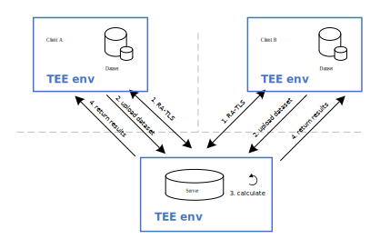

# Private Set Intersection (PSI) with Intel SGX

## Introduction
Private Set Intersection (PSI) is an application hotspot of multi-party secure computing. Its purpose is to calculate the intersection between the two parties through a secure scheme without exposing other information beyond the intersection. 

There are many implementations of PSI, some of which are based on cryptographic algorithms, such as the RSA algorithm. However, the methods based on cryptography usually have problems such as slow intersection speed, complicated algorithm leads to high memory usage, and do not support multi-party intersection.

In this Private Set Intersection solution, we adopted a privacy protection computing solution based on Intel SGX technology.

### Encrypted runtime environment
Intel SGX technology offers hardware-based memory encryption that isolates specific application code and data in memory and it allows user-level code to allocate private regions of memory, called enclaves, which are designed to be protected from processes running at higher privilege levels.

Intel SGX also helps protect against SW attacks even if OS/drivers/BIOS/VMM/SMM are compromised and helps increase protections for secrets even when attacker has full control of platform.

### Encrypted transmission and remote attestation
In the communication part of Private Set Intersection solution, we use Intel SGX Remote Attestation with Transport Layer Security (RA-TLS) technology to perform encrypted transmission and verification of program integrity.[<sup>[1]</sup>](#refer-anchor-1) RA-TLS integrates Intel SGX remote attestation with the establishment of a standard Transport Layer Security (TLS) connection. Remote attestation is performed during the connection setup by embedding the attestation evidence into the endpoints TLS certificate.

## Privacy protection
This solution mainly contains the items listed below: 
-	Security Isolation LibOS – Gramine, an open-source project for Intel SGX, can run applications with no modification in Intel SGX. 
-	Platform Integrity - Providing Remote Attestation mechanism, so that user can gain trust in the remote Intel SGX platform.

In this solution, privacy protection is provided in the following aspects:
### Runtime security using Intel-SGX
During the intersection process, the data of each participant is stored inside the Intel SGX enclave. Intel SGX provides some assurance that no unauthorized access or memory snooping of the enclave occurs to prevent any leakage of data information.
### In-Transit security
We use the Remote Attestation with Transport Layer Security (RA-TLS) of Intel SGX technology to ensure security during transmission. This technology is proposed by Intel's security team, which combines TLS technology and remote attestation technology. RA-TLS uses TEE as the hardware root of trust. The certificate and private key are generated in the enclave and are not stored on the disk. Therefore, it is impossible for the participants to obtain the certificate and private key in plain text, so man-in-the-middle attacks cannot be carried out. In this Private Set Intersection solution, RA-TLS is used to ensure the encrypted transmission of participant's data.
### Application integrity
To solve the problem of how to verify the untrusted application integrity, we use RA-TLS to verify the Intel SGX enclave. It ensures that the runtime application is a trusted version.


## Workflow
Our solution is implemented in a trusted execution environment, and its architecture is as follows:

  

The computing phase can be divided into the following steps:

&emsp;&ensp;**1.** All participants run in the TEE environment. Each client completes two-way authentication with the server through RA-TLS.

&emsp;&ensp;**2.** Clients transmit data securely and upload it to the server.

&emsp;&ensp;**3.** The server side waits for the data upload of all clients to complete, and then calculates the intersection of the data.

&emsp;&ensp;**4.** The server side sends the calculation results back to each participant through secure transmission.

In the above process, the client can only obtain the intersection data, but not the non-intersection data belonging to other clients. The server side is only responsible for computing, and will not save or steal the data sent by clients.

## Build and installation

Currently, we only support building and installation from the source code. It will generate a docker 
images for developing the gRPC RA-TLS application.

### Prerequisites

- Ubuntu 18.04. This solution should work on other Linux distributions as well,
  but for simplicity we provide the steps for Ubuntu 18.04 only.

- Docker Engine. Docker Engine is an open source containerization technology for
  building and containerizing your applications.
  Please follow [this guide](https://docs.docker.com/engine/install/ubuntu/#install-using-the-convenience-script)
  to install Docker engine.


- Private Set Intersection source package:

    ```shell
    git clone https://github.com/intel/confidential-computing-zoo.git
    ```

- Intel SGX Driver and SDK/PSW. You need a machine that supports Intel SGX and FLC/DCAP. Please follow this guide to install the Intel SGX driver and SDK/PSW on the machine/VM. Make sure to install the driver with ECDSA/DCAP attestation.
After Intel SGX DCAP is setup, verify the Intel Architectural Enclave Service Manager is active (running)::

    ```shell
   sudo systemctl status aesmd
    ```

- Gramine. Follow [Quick Start](https://gramine.readthedocs.io/en/latest/quickstart.html)
  to learn more about it.
  
### Setup LibOS

   - Gramine
        ```bash
        cd cczoo/common/docker/gramine
        ./build_docker_image.sh [ubuntu/anolisos]
        ```

### Setup develop environment of gRPC RA-TLS based on Intel SGX

   - Gramine
        ```bash
        cd -
        cd cczoo/psi/gramine
        ./build_docker_image.sh [ubuntu/anolisos]
        ```

## Run PSI examples

We use a two-way atttestation scheme. The client and server on both sides of the communication authenticate each other.

This example only shows an example of deploying PSI locally. If you want to deploy the participants on different machines, please make sure that the correct measurements are filled in the `dynamic_config.json` file to ensure that the remote verification passes.

- Gramine

   	Prepare the docker container

   	```bash
   	cd cczoo/psi
   
   	#start and enter the docker container
   	./start_container.sh <pccs_service_ip> <image_tag>
   	```

    ### Run the Python example
	
    Build Python example

	```bash
	cd CI-Examples/psi/python
    ./build.sh
	```
	
	Two-party:

    ```bash
    # Run the server
    gramine-sgx python -u server.py -host localhost:50051 -config dynamic_config.json &
    
    # Run the client1
	gramine-sgx python -u data_provider1.py -host localhost:50051 -config dynamic_config.json -is_chief True -data_dir "data1.txt" -client_num 2 &
    
    # Run the client2
	gramine-sgx python -u data_provider2.py -host localhost:50051 -config dynamic_config.json -is_chief False -data_dir "data2.txt" -client_num 2 &
    ```

    Each client will get the intersection result:
    ```shell
    ['car', 'cat', 'train']
    ```

	Our solution supports the intersection of three and more parties. Examples of three-party intersection:

    ```bash
    # Run the server
    gramine-sgx python -u server.py -host localhost:50051 -config dynamic_config.json &
    
    # Run the client1
	gramine-sgx python -u data_provider1.py -host localhost:50051 -config dynamic_config.json -is_chief True -data_dir "data1.txt" -client_num 3 &
    
    # Run the client2
	gramine-sgx python -u data_provider2.py -host localhost:50051 -config dynamic_config.json -is_chief False -data_dir "data2.txt" -client_num 3 &
    
    # Run the client3
	gramine-sgx python -u data_provider3.py -host localhost:50051 -config dynamic_config.json -is_chief False -data_dir "data3.txt" -client_num 3 &
    ```

    Each client will get the intersection result:
    ```shell
    ['train', 'car', 'cat']
    ```

    ### Run the C++ example
    
    Build C++ example

    ```bash
	cd CI-Examples/psi/cpp
    ./build.sh
    ```

	Two-party:

    ```bash
    # Run the server
    cd runtime/server
    gramine-sgx grpc -host=localhost:50051 -config=dynamic_config.json &
    
    # Run the client1
    cd -
    cd runtime/data_provider1
    gramine-sgx grpc -host=localhost:50051 -config=dynamic_config.json -is_chief=true -client_num=2 data_dir="data1.txt" client_name="data_provider1" &
    
    # Run the client2
    cd -
    cd runtime/data_provider2
    gramine-sgx grpc -host=localhost:50051 -config=dynamic_config.json -is_chief=false -client_num=2 data_dir="data2.txt" client_name="data_provider2" &
    ```

    Each client will get the intersection result:
    ```shell
    car
    cat
    train
    ```

    Three-party:

    ```bash
    # Run the server
    cd runtime/server
    gramine-sgx grpc -host=localhost:50051 -config=dynamic_config.json &
    
    # Run the client1
    cd -
    cd runtime/data_provider1
    gramine-sgx grpc -host=localhost:50051 -config=dynamic_config.json -is_chief=true -client_num=3 data_dir="data1.txt" client_name="data_provider1" &
    
    # Run the client2
    cd -
    cd runtime/data_provider2
    gramine-sgx grpc -host=localhost:50051 -config=dynamic_config.json -is_chief=false -client_num=3 data_dir="data2.txt" client_name="data_provider2" &
    
    # Run the client3
    cd -
    cd runtime/data_provider3
    gramine-sgx grpc -host=localhost:50051 -config=dynamic_config.json -is_chief=false -client_num=3 data_dir="data3.txt" client_name="data_provider3" &
    ```

    Each client will get the intersection result:
    ```shell
    car
    cat
    train
    ```
