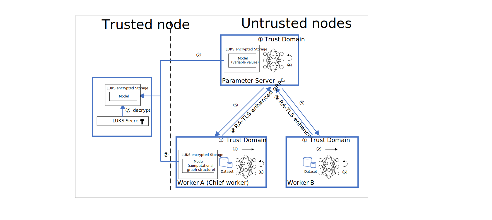

# Horizontal Federated Learning with Intel TDX

This solution presents a framework for developing a PPML (Privacy-Preserving Machine Learning) solution based on TensorFlow - Horizontal Federated Learning with Intel TDX.


## Introduction

Federated learning is particularly relevant to deep neural networks, enabling the security of participants in distributed training processes. With horizontal federated learning, each participant uses it's own local data for algorithm iteration and instead of raw data, only uploads gradient information to better guarantee data privacy.

The commonly used encryption method in federated learning is Homomorphic Encryption (HE). In addition to HE, trusted execution environment (TEE) technology uses plaintext for calculation with a trusted computing base to ensure security. Intel TDX technology is a concrete realization of TEE technology. In this horizontal federated learning solution, we adopted a privacy protection computing solution based on Intel TDX technology.

This solution includes the following core components: 

- RA-TLS enhanced gRPC – The RA-TLS technology is integrated in the gRPC framework to ensure the security of data transmission and enable remote verification technology.
- Federated training – Propose a federated training solution based on Intel TDX and RA-TLS technology.
- Model Protection – Using LUKS encryption to protect model confidentiality and integrity during model training and model transfer. 


## Privacy Protection

In this solution, privacy protection is provided in the following aspects.

### Runtime Security Using Intel TDX

Intel TDX technology offers hardware-based memory encryption that isolates specific application code and data in memory. Intel TDX allows user-level code to allocate private regions of memory based on a TD (Trust Domain) environment.

Intel TDX also helps protect against SW attacks even if OS/drivers/BIOS/VMM/SMM are compromised and helps increase protections for secrets even when an attacker has full control of a compromised platform.

In the training phase of federated learning, the gradient information is stored inside the TD. Intel TDX provides assurance that no unauthorized access or memory snooping of the TD can occur which prevents leakage of gradient and model information.

### Encrypted Transmission with Remote Attestation

We use the Remote Attestation with Transport Layer Security (RA-TLS) of Intel TDX technology to ensure security during transmission. This technology combines TLS technology and remote attestation technology. RA-TLS uses TEE as the hardware root of trust. The certificate and private key are generated in the TD and are not stored on the disk. Therefore, participants cannot obtain the certificate and private key in plain text, preventing man-in-the-middle attacks. In this federated learning solution, RA-TLS is used to ensure the encrypted transmission of gradient information.

For more information about RA-TLS, please refer to the relevant [documentation](https://cczoo.readthedocs.io/en/latest/Solutions/grpc-ra-tls/index.html) and [code](https://github.com/intel/confidential-computing-zoo/tree/main/cczoo/grpc-ra-tls).

### Model At-Rest Security 

The model generated during the training process is encrypted in a LUKS storage volume only visible in the TD to protect it from being acquired by malicious hosts. Additionally, the Trusted machine containing LUKS Secrets is used to obtain the model from the TD through the use of RA-TLS technology for safe migration.


## Workflow

In the training process, each worker uses local data in its TD and sends the gradient information in the backpropagation process to the parameter server with RA-TLS technology. The parameter server completes the gradient aggregation and updates network parameters, then sends the updated parameters to each worker. The following is an illustration of this workflow:



The training phase can be divided into the following steps:

&emsp;&ensp;**①** Using Intel TDX technology, the training program of each participant runs in different TDs. Each TD creates an encrypted model directory on LUKS storage volume and prepares a LUKS decryption service.

&emsp;&ensp;**②** Workers calculate gradient information based on local data in the TD.

&emsp;&ensp;**③** Workers send gradient information to a parameter server through RA-TLS enhanced gRPC.

&emsp;&ensp;**④** The parameter server performs gradient aggregation and updates global model parameters.

&emsp;&ensp;**⑤** The parameter server sends model parameters to workers.

&emsp;&ensp;**⑥** Workers update local model parameters.

&emsp;&ensp;**⑦** Steps **②** to **⑥** are repeated until the end of training. Finally, the training model directory is transmitted to the remote trusted node and decrypted.


## Horizontal Federated Training Execution

This reference solution trains the ResNet-50 image classification model using the CIFAR-10 dataset.

### Prerequisites

- Intel TDX capable systems/VMs.
- Docker Engine. Docker Engine is an open-source containerization technology for building and containerizing your applications. Please refer to [this docker installation guide for Ubuntu](https://docs.docker.com/engine/install/ubuntu/#install-using-the-convenience-script)
  to install Docker engine. It is recommended to use a data disk of at least 128GB for the docker daemon data directory. You may refer to [this docker daemon guide](https://docs.docker.com/config/daemon/#daemon-data-directory) to configure the data directory. If behind a proxy server, please refer to [this docker daemon guide for systemd](https://docs.docker.com/config/daemon/systemd/) for configuring proxy settings.
- CCZoo source downloaded to each TD VM:

```bash
    git clone https://github.com/intel/confidential-computing-zoo.git
    cczoo_base_dir=$PWD/confidential-computing-zoo
```

### Configuration

- Framework: TensorFlow 2.6.0
- Model: ResNet-50
- Dataset: CIFAR-10
- Parameter Server num: 1
- Worker num: 2
- Total containers: 3

### Build and Start Containers

Build the container image on the TD VM(s). Alternatively, the container image can be built on any system and then transferred to the TD VMs.

#### Azure Deployments

For Azure deployments:

```bash
cd ${cczoo_base_dir}/cczoo/horizontal_fl_tdx
./build_docker_image.sh azure
```

NOTE: To specify the proxy server, set the `proxy_server` variable prior to the call to `build_docker_image.sh`. For example:
      
```bash
proxy_server=http://proxyserver:port ./build_docker_image.sh azure
```

Start three containers (`ps0`, `worker0`, `worker1`). Replace `<role>` with the role of the container (either `ps0`, `worker0`, or `worker1`). Replace `<image_id>` with the image ID of the container built from the previous step.

```bash
cd ${cczoo_base_dir}/cczoo/horizontal_fl_tdx
./start_container.azure.sh <role> <image_id>
```

#### Default Cloud Deployments

For cloud deployments other than on Azure:

```bash
cd ${cczoo_base_dir}/cczoo/horizontal_fl_tdx
./build_docker_image.sh default
```

NOTE: To specify the proxy server, set the `proxy_server` variable prior to the call to `build_docker_image.sh`. For example:
      
```bash
proxy_server=http://proxyserver:port ./build_docker_image.sh
```

***Notice:*** 
If you are using non-production version Intel CPU, please modify the Dockerfile to replace `/usr/lib64/libsgx_dcap_quoteverify.so` with the non-production version.

Start three containers (ps0, worker0, worker1). Replace `<role>` with the role of the container (either `ps0`, `worker0`, or `worker1`). Replace `<image_id>` with the image ID of the container built from the previous step.

```bash
cd ${cczoo_base_dir}/cczoo/horizontal_fl_tdx
./start_container.sh <role> <image_id>
```

### Configure Node Network Addresses

If running in an environment with distributed nodes (for example, each container is running on a separate VM), configure the node IP addresses by modifying `/hfl-tensorflow/train.py` in each container:

```bash
tf.app.flags.DEFINE_string("ps_hosts", "['localhost:60002']", "ps hosts")
tf.app.flags.DEFINE_string("worker_hosts", "['localhost:61002','localhost:61003']", "worker hosts")
```

***Notice:***

1. You need to replace the `localhost` fields in the above code snippet with the IP address of the VMs where the training script is deployed.
2. Make sure that the port number configured on the current node has been enabled on the corresponding VM.

### Configure Attestation Parameters

From each container, configure attestation parameters.

#### Azure Deployments

From each container, modify `/etc/azure_tdx_config.json` to configure the attestation verifier service parameters.

To use [Intel Trust Authority](https://www.intel.com/content/www/us/en/security/trust-authority.html), modify `/etc/azure_tdx_config.json` as follows, specifying your Intel Trust Authority API key: `"api_key": "your project amber api key"`:

```bash
{
  "attestation_url": "https://api.projectamber.intel.com/appraisal/v1/attest",
  "attestation_provider": "amber",
  "api_key": "your project amber api key"
}
```

To use [Microsoft Azure Attestation](https://azure.microsoft.com/en-us/products/azure-attestation), modify `/etc/azure_tdx_config.json` as follows (an API key is not required):

```bash
{
  "attestation_url": "https://sharedeus2e.eus2e.attest.azure.net/attest/TdxVm?api-version=2023-04-01-preview",
  "attestation_provider": "maa",
  "api_key": ""
}
```

#### Default Cloud Deployments

For other cloud deployments, in all three containers, modify the `PCCS server address` in the `sgx_default_qcnl.conf` file and fill in the PCCS address of the cloud. Ignore the `<PCCS ip addr>` parameter.

### Create Encrypted Storage

For each container, create a LUKS encrypted volume for the model files. When prompted for confirmation, type `YES` (in all uppercase) and enter a passphrase at the prompt which will be used to decrypt the volume. Take note of the loop device name as displayed in the output from `create_encrypted_vfs.sh`.

```bash
cd /luks_tools
export VIRTUAL_FS=/root/vfs
./create_encrypted_vfs.sh ${VIRTUAL_FS}
```

Replace `<loop device>` with the loop device name provided by `create_encrypted_vfs.sh` (for example, `/dev/loop0`).
Replace `<role>` with the role of the container (either `ps0`, `worker0`, or `worker1`).

```bash
export LOOP_DEVICE=<loop device>
export ROLE=<role>
```

Format the block device as ext4. Enter the passphrase when prompted to decrypt the volume.

```bash
./mount_encrypted_vfs.sh ${LOOP_DEVICE} format ${ROLE}
```

Remount the encrypted volume. Enter the passphrase from earlier when prompted.

```bash
./unmount_encrypted_vfs.sh ${ROLE}
./mount_encrypted_vfs.sh ${LOOP_DEVICE} noformat ${ROLE}
```

### Run Training Scripts

Run the training script from each container.

From the parameter server (`ps0`) container:

```bash
cd /hfl-tensorflow
./test-tdx.sh ps0
```

From the `worker0` container:

```bash
cd /hfl-tensorflow
./test-tdx.sh worker0
```

From the `worker1` container:

```bash
cd /hfl-tensorflow
./test-tdx.sh worker1
```

Review the training log information from the workers' terminals to confirm that the training is running normally.

At the beginning of training, remote attestation between the nodes will be performed. Only after the remote attestation succeeds can the training begin. After successful remote attestation, the terminal will output the following:

```bash
Info: App: Verification completed successfully.
```

The model files generated during training will be saved in the `model` folder. In this example, the information related to variable values is stored in `model/model.ckpt-data` of `ps0`, and the information related to the computational graph structure is stored in `model/model.ckpt-meta` of `worker0`.

Training is completed when both worker containers display the following output: `Optimization finished`.

After training is complete, unmount the LUKS volume on each container. Replace `<role>` with the role of the container (either `ps0`, `worker0`, or `worker1`). 

```bash
export ROLE=<role>
cd /luks_tools
./unmount_encrypted_vfs.sh ${ROLE}
```

### Transfer Encrypted Model Files to Trusted Node

Transfer the LUKS encrypted partition (`/root/vfs`) of the `ps0` and `worker0` containers to a trusted node. (The VM's `/home` directory is mounted to each container at `/home/host-home` to facilitate the file transfer for demonstration purposes).

From the trusted node, as the `root` user, decrypt the LUKS volume. Replace `<path to vfs file>` with the path to the vfs file.

```bash
export VIRTUAL_FS=<path to vfs file>
export LOOP_DEVICE=$(losetup -f)
losetup ${LOOP_DEVICE} ${VIRTUAL_FS}
cryptsetup luksOpen ${LOOP_DEVICE} model
mkdir -p /root/model
mount /dev/mapper/model /root/model
```

The decrypted model files can now be obtained on the trusted node:

```bash
ls -l /root/model
```

When done examining the model files, unmount the LUKS partition:

```bash
umount /root/model
cryptsetup luksClose /dev/mapper/model
```

---

## Cloud Deployment

### 1. Aliyun ECS

[Aliyun ECS](https://help.aliyun.com/product/25365.html) (Elastic Compute Service) is
an IaaS (Infrastructure as a Service) level cloud computing service provided by Alibaba
Cloud. It builds eighth generation security-enhanced instance families based on Intel® TDX technology to provide a trusted and confidential environment with a higher security level.

To build a TDX confidential computing instance, please refer to the following links:

Chinese version: https://www.alibabacloud.com/help/zh/elastic-compute-service/latest/build-a-tdx-confidential-computing-environment

English version：https://www.alibabacloud.com/help/en/elastic-compute-service/latest/build-a-tdx-confidential-computing-environment

***Notice:*** Ali TDX instances are under external public preview.

### 2. Microsoft Azure

Microsoft Azure [DCesv5-series](https://azure.microsoft.com/en-us/updates/confidential-vms-with-intel-tdx-dcesv5-ecesv5/) instances support Intel® TDX confidential computing technology.

The following is the configuration of the DCesv5-series instance used:

- Instance Type  : Standard_DC16es_v5
- Instance Kernel: 6.2.0-1016-azure
- Instance OS    : Ubuntu 22.04 LTS Gen 2 TDX

***Notice:*** Azure DCesv5-series instances were used under private preview.

