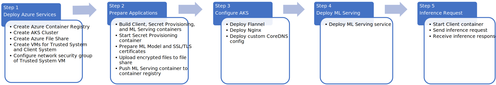

# CCZoo PPML Online Inferencing on Intel® SGX and Gramine

## Introduction

Typical security measures may assist data at rest and in transit but often fall short of fully protecting data while it is actively used in memory. Intel® Software Guard Extensions (Intel® SGX) helps protect data in use via application isolation technology. By protecting selected code and data from modification, developers can partition their application into hardened enclaves or trusted execution modules to help increase application security. Users can use Intel® SGX to secure their confidential computing applications.

This article introduces you to a confidential computing solution for PPML (Privacy Preserving Machine Learning) Serving online inference. This solution leverages components such as Intel® SGX confidential computing VM nodes for [Azure Kubernetes Service](https://azure.microsoft.com/en-us/products/kubernetes-service) (AKS), [Microsoft Azure Attestation](https://azure.microsoft.com/en-au/products/azure-attestation/) (MAA), Gramine library OS, and TensorFlow. This solution is one of many reference solutions provided by the [Confidential Computing Zoo](https://github.com/intel/confidential-computing-zoo) (CCZoo), a collection of code-ready reference solutions, which can be used as a copy-paste developer guide, demonstrating how to apply modern security technologies to real-life cloud business scenarios. CCZoo helps developers build their own end-to-end confidential computing solutions more easily.

:warning: Running a full online inferencing service raises security questions that you need to address before using the solution presented in this article for production purpose. Please consider the solution presented in this article as a sample only.

## Solution Architecture
The section describes the workflow for the ML Serving online inference solution when deployed using Azure cloud services.


1. Azure Confidential Computing (ACC) systems provisioned. For each ACC SGX-enabled system, the Microsoft Azure Attestation (MAA) Provider retrieves and caches the corresponding SGX certificates from the Intel Provisioning Certification Service, along with Certificate Revocation Lists (CRLs) and other SGX-identifying information. This step is only performed once during SGX platform provisioning.

2. Application owner uploads encrypted model to Azure File Share. From the Trusted System, the application owner uses a cryptographic wrap key to encrypt the ML model and private TLS key and uploads them to the Azure File Share. Encryption protects these files at-rest. The ML model is used to serve inference requests. The private TLS key is used for communication between the ML Serving application and the clients making inference requests.

3. Application owner builds ML Serving container image and uploads image to Azure Container Registry. The SGX-enabled ML Serving container image includes TensorFlow Serving, Gramine (with MAA support) and the Azure DCAP Client. The expected SGX measurements of the ML Serving application are saved on the Trusted System to later validate the integrity of each Kubernetes pod running the ML Serving application. The container image is uploaded to the Azure Container Registry.

4. Application owner starts Secret Provisioning service on Trusted System. The Secret Provisioning service includes Gramine (with MAA support) and the Azure DCAP Client.

5. Application owner deploys SGX-enabled ML Serving application on Azure Kubernetes Service (AKS) cluster. AKS is used to create/manage a cluster of SGX-enabled nodes with the Intel® SGX Device Plugin for AKS. The ML Serving service deployment retrieves the ML Serving container image from Azure Container Registry. The ML Serving application runs in SGX enclaves on Azure Confidential Computing nodes.

6. ML Serving application retrieves encrypted model. The ML Serving application retrieves the encrypted model and encrypted private TLS key from the Azure File Share.

7. ML Serving application requests model decryption key. The ML Serving application requests the decryption key from the Secret Provisioning service. Communication between the ML Serving application and the Secret Provisioning service is protected using [RA-TLS](https://gramine.readthedocs.io/en/stable/glossary.html#term-ra-tls).

8. ML Serving application integrity is verified. The Secret Provisioning service contacts the MAA provider with the SGX quote embedded in the RA-TLS certificate chain and uses the previously stored expected SGX measurements to verify the integrity of the ML Serving application and that the ML Serving application is running in an SGX enclave of a genuine up-to-date SGX platform.

9. Secret Provisioning service responds with model decryption key. If the ML serving application integrity is verified and the ML Serving application is verified to be running in an SGX enclave, the Secret Provisioning service responds with the model decryption key.

10. ML Serving application decrypts model within SGX enclave. Since the model and private TLS key are decrypted within an SGX enclave, these plaintext files are protected in-use. The ML Serving application reads in the model and waits for inference requests.

11. Client makes inference request. The client uses the public TLS key to establish a gRPC TLS connection with the ML Serving service, which protects the interference request data in-transit.

12. Client inference requests are load balanced. Client requests are load balanced in the AKS cluster and requests are forwarded to the ML Serving service.

13. ML Serving application sends inference result back to client. The ML Serving application processes the inference request and the inference result is sent back to the client via gRPC TLS, which protects the inference response data in-transit.

## Solution Deployment
The following steps can be used to deploy the CCZoo ML Serving online inference solution using Azure Cloud Services.



### Step 1: Deploy Azure Cloud Services
1.1 Create an Azure container registry. This [guide](https://learn.microsoft.com/en-us/azure/container-registry/container-registry-get-started-portal) can be used as a reference for how to create an Azure container registry.

1.2 Create an AKS cluster with confidential computing nodes, specifying DC16s_v3 as the node VM size, and specifying the container registry created in step 1.1. For more information about using AKS with confidential computing nodes, please refer to this [guide](https://learn.microsoft.com/en-us/azure/confidential-computing/confidential-enclave-nodes-aks-get-started). 

1.3 Enable confidential computing AKS add-on. Please refer to this [guide](https://learn.microsoft.com/en-us/azure/confidential-computing/confidential-enclave-nodes-aks-get-started#enable-the-confidential-computing-aks-add-on-on-the-existing-cluster) to enable the confidential computing AKS add-on for the AKS cluster created in step 1.2.

1.4 Create an Azure file share. For more information about using Azure file shares, please refer to this [guide](https://learn.microsoft.com/en-us/azure/storage/files/storage-how-to-use-files-portal).

1.5 For demonstration purposes, the default Microsoft Azure Attestation Service Provider (`https://sharedcus.cus.attest.azure.net`) is used with default policies. For more information about Azure Attestation, please refer to this [guide](https://learn.microsoft.com/en-us/azure/attestation/quickstart-portal).

1.6 For demonstration purposes, create two Azure VMs (D16s_v5, Ubuntu Server 20.04 LTS). One VM will be used as the Trusted System, the other VM will be used as the Client System.

1.7 Install Docker Engine on the Trusted System VM and the Client System VM. For more information about how to setup Docker Engine, please refer to this [guide](https://docs.docker.com/engine/install/ubuntu/#install-using-the-convenience-script).

1.8 Configure the network security group of the Trusted System VM to add an Inbound Port Rule for the Secret Provisioning service port 4433. This [guide](https://learn.microsoft.com/en-us/azure/virtual-network/network-security-groups-overview) gives an overview of Azure network security groups.

### Step 2: Prepare Applications
2.1 On the Client System VM, download the client container image:

```shell
   docker pull intelcczoo/tensorflow_serving:default_client_latest
```

   (Alternatively, on the Client System VM, you can [build the Client container image](index.rst#12-alternatively-build-client-container-image) specifying the `default` build.)

2.2 On the Trusted System VM, download the Secret Provisioning container image.

```shell
   docker pull intelcczoo/tensorflow_serving:azure_secret_prov_server_latest
```

   (Alternatively, you can [build the Secret Provisioning container image](index.rst#22-alternatively-build-secret-provisioning-server-container-image) specifying the `azure` build.)

2.3 Download the ML Serving container image to a system that has push access to your Azure Container Registry,:

```shell
   docker pull intelcczoo/tensorflow_serving:azure_tensorflow_serving_latest
```

   (Alternatively, you can [build the ML Serving container image](index.rst#32-alternatively-build-tensorflow-serving-container-image) specifying the `azure` build.)

2.4 [Obtain the ML Serving Container SGX Measurements.](index.rst#4-obtain-the-tensorflow-serving-container-sgx-measurements)

2.5 On the Trusted System VM, using the SGX measurements from step 2.4, [update the expected ML Serving container’s SGX measurements for the Secret Provisioning container](index.rst#5-update-expected-tf-serving-container-sgx-measurements-for-the-secret-provisioning-server).

2.6 [Run the Secret Provisioning container](index.rst#6-run-secret-provisioning-server-container) using the steps for use on Azure. For demonstration purposes, the Secret Provisioning container is run on the Trusted System VM.

2.7 [Prepare ML model and SSL/TLS certificates.](index.rst#7-prepare-ml-model-and-ssltls-certificates) When preparing the SSL/TLS certificates, select two-way authentication. The ML model used in this solution is ResNet-50. The SSL/TLS certificates are used for the gRPC TLS communication between the client and the ML Serving application.

2.8 Upload the encrypted ML model (`saved_model.pb`) and the encrypted private TLS key (`ssl.cfg`) from step 2.7 to the root directory of your Azure File Share.

2.9 Push the ML Serving container (from Step 2.3) to your Azure Container Registry.

2.10 Copy ssl_configure.tar from Step 2.7 to `<cczoo_base_dir>/cczoo/tensorflow-serving-cluster/tensorflow-serving/docker/client` on the Client System VM, and from that directory, extract the following certificate files as shown below:

```shell
   tar -xvf ssl_configure.tar ssl_configure/client/key.pem
   tar -xvf ssl_configure.tar ssl_configure/client/cert.pem
   tar -xvf ssl_configure.tar ssl_configure/ca_cert.pem
```


### Step 3: Configure AKS
Perform the following steps using Azure Cloud Shell.

3.1 Download CCZoo source code:

```shell
   cd ~
   git clone https://github.com/intel/confidential-computing-zoo
   cd confidential-computing-zoo/cczoo/tensorflow-serving-cluster
```

3.2 Modify custom CoreDNS deployment file `tensorflow-serving/kubernetes/coredns_custom.yaml` replacing `x.x.x.x` with the public IP address of the Trusted System VM.

3.3 Deploy Flannel, Nginx, and custom CoreDNS configuration:

```shell
   kubectl apply -f kubernetes/flannel/deploy.yaml
   kubectl apply -f kubernetes/ingress-nginx/deploy-nodeport.yaml
   kubectl apply -f tensorflow-serving/kubernetes/coredns_custom.yaml
```

### Step 4: Deploy ML Serving
4.1 Perform the following steps in the Azure Cloud Shell.

```shell
   cd ~/confidential-computing-zoo/cczoo/tensorflow-serving-cluster/tensorflow-serving/kubernetes
```
 
4.2 Modify `deploy_for_aks.yaml`. For the `image:` value, replace the string `<acrName>` with your Azure Container Registry name and replace the container image tag (if needed). For the `shareName:` value, replace the string `<fileShareName>` with your Azure File Share name.

4.3 Run the following commands to deploy the ML Serving service, replacing the string `<resourceGroup>` with your Azure resource group, and replacing the string `<storageAcctName>` with your Azure storage account name:

```shell
   resource_group=<resourceGroup>
   storage_acct_name=<storageAcctName>
   ./apply_tf-serving_aks.sh ${resource_group} ${storage_acct_name}
```

4.4 Get the status of the deployment. Wait until all pods are in the Running state and the service external IP address is assigned. Take note of the `EXTERNAL-IP` of the ML Serving service.

```shell
   $ ./status_tf-serving.sh
   NAME                                             READY   STATUS    RESTARTS   AGE
   gramine-tf-serving-deployment-5d48668d94-4l7js   1/1     Running   0          12m
   gramine-tf-serving-deployment-5d48668d94-cr4q7   1/1     Running   0          12m
   gramine-tf-serving-deployment-5d48668d94-mmkf6   1/1     Running   0          12m
   gramine-tf-serving-deployment-5d48668d94-w9xfm   1/1     Running   0          12m
   NAME                         TYPE           CLUSTER-IP   EXTERNAL-IP   PORT(S)          AGE
   gramine-tf-serving-service   LoadBalancer   x.x.x.x      x.x.x.x       8500:30636/TCP   12m
```

4.5 View the logs from the pods (specifying your actual pod names), for example:

```shell
   kubectl logs -n gramine-tf-serving gramine-tf-serving-deployment-5d48668d94-w9xfm
```

The ML Serving application is ready to service inference requests when the following log is output:

```shell
[evhttp_server.cc : 245] NET_LOG: Entering the event loop ...
```

### Step 5: Inference Request
5.1 [Start the Client container](index.rst#92-run-client-container), using the external IP address of the ML Serving service (from Step 4.4) for the `-t <IPADDR>` parameter.

5.2 From the Client container, send the inference request:

```shell
   cd client
   ./run_inference.sh twoway_ssl
```

5.3 Observe the inference response output that begins with the following string:

```shell
   {'outputs': {'predict': {'dtype': 'DT_FLOAT', 'tensorShape':
```

## Solution Components
This end-to-end confidential computing solution leverages the following components.

### Azure Cloud Services:
* [Azure Kubernetes Service (AKS)](https://azure.microsoft.com/en-us/products/kubernetes-service): Deploy and scale containers on managed Kubernetes.
* [Azure Container Registry](https://azure.microsoft.com/en-us/products/container-registry): A registry of Docker and Open Container Initiative (OCI) images, with support for all OCI artifacts.
* [Azure Files](https://azure.microsoft.com/en-us/products/storage/files): Simple, secure, and serverless enterprise-grade cloud file shares.
* [Microsoft Azure Attestation](https://azure.microsoft.com/en-us/products/azure-attestation): A unified solution for remotely verifying the trustworthiness of a platform and integrity of the binaries running inside it.

### Intel® SGX
* [Intel® Software Guard Extensions (Intel® SGX)](https://www.intel.com/content/www/us/en/developer/tools/software-guard-extensions/overview.html) helps protect data in use via application isolation technology. By protecting selected code and data from modification, developers can partition their application into hardened enclaves or trusted execution modules to help increase application security.

### Gramine
* [Gramine](https://github.com/gramineproject/gramine) is a lightweight library OS, designed to run a single application with minimal host requirements. Gramine runs unmodified applications inside Intel® SGX.

### Confidential Computing Zoo
* [CCZoo](https://github.com/intel/confidential-computing-zoo) is a collection of code-ready reference solutions, which can be used as a copy-paste developer guide, demonstrating how to apply modern security technologies to real-life cloud business scenarios. CCZoo helps developers build their own end-to-end confidential computing solutions more easily. Please refer to the CCZoo [GitHub repository](https://github.com/intel/confidential-computing-zoo) and [documentation](https://cczoo.readthedocs.io/en/latest/index.html) for more details.

### TensorFlow Serving
* [TensorFlow Serving](https://github.com/tensorflow/serving) is a flexible, high-performance serving system for machine learning models, designed for production environments.


## References
1. https://www.intel.com/content/www/us/en/developer/tools/software-guard-extensions/overview.html
2. https://github.com/Azure-Samples/azure-ml-federated-learning/blob/main/README.md
3. https://github.com/gramineproject/gramine/blob/a2166216fd795adfa7391be7fb6398116c317ee3/Documentation/attestation.rst
4. https://techcommunity.microsoft.com/t5/azure-confidential-computing/bigdl-privacypreserving-machine-learning-with-occlum-oss-on/ba-p/3658667
