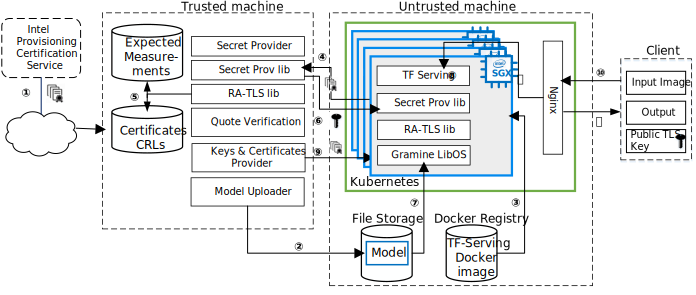
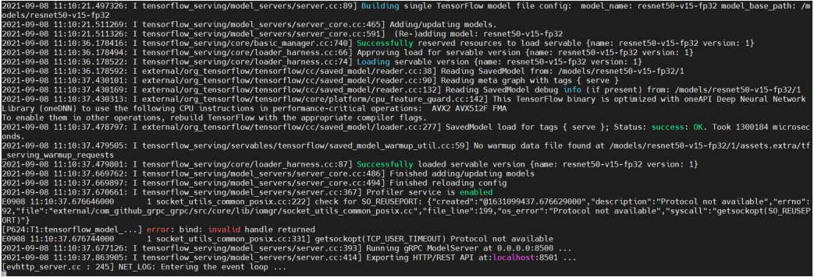

========================================
TensorFlow Serving Cluster PPML Solution
========================================

This solution presents a framework for developing a PPML (Privacy-Preserving
Machine Learning) solution - `TensorFlow Serving <https://www.tensorflow.org/tfx/guide/serving>`__
cluster with Intel SGX and Gramine.

Introduction
------------

Simply running a TensorFlow Serving system inside Gramine is not enough for a
safe & secure end-user experience. Thus, there is a need to build a complete
secure inference flow. This paper will present TensorFlow Serving with Intel
SGX and Gramine and will provide end-to-end protection (from client to servers)
and integrate various security ingredients such as the load balancer (Nginx
Ingress) and elastic scheduler (Kubernetes). Please refer to `What is Kubernetes
<https://www.redhat.com/en/topics/containers/what-is-kubernetes>`__ for more
details.

.. image:: ./img/NGINX-Ingress-Controller.svg
   :target: ./img/NGINX-Ingress-Controller.svg
   :scale: 80 %
   :alt: Figure: Nginx Ingress controller

In this solution, we focus on:

- AI Service - TensorFlow Serving, a flexible, high-performance serving system
  for machine learning models.
- Model protection - protecting the confidentiality and integrity of the model
  when the inference takes place on an untrusted platform such as a public cloud
  virtual machine.
- Data protection - establishing a secure communication link from end-user to
  TensorFlow Serving when the user doesn’t trust the remote platform where the
  TensorFlow Serving system is executing.
- Platform Integrity - providing a way for Intel SGX platform to attest itself
  to the remote user, so that she can gain trust in the remote SGX platform.
- Elasticity - providing the Kubernetes service for automating deployment,
  scaling, and management of containerized TensorFlow Serving so that the cloud
  providers can setup the environment easily. We use Nginx for automatic load
  balancing.

The goal of this solution is to show how these applications - TensorFlow Serving
and Kubernetes - can run in an untrusted environment (like a public cloud),
automating deployment while still ensuring the confidentiality and integrity of
sensitive input data and the model. To this end, we use Intel SGX enclaves to
isolate TensorFlow Serving's execution to protect data confidentiality and
integrity, and to provide a cryptographic proof that the program is correctly
initialized and running on legitimate hardware with the latest patches. We also
use Gramine to simplify the task of porting TensorFlow Serving to SGX, without
any changes.

In this tutorial, we use three machines: client trusted machine, it can be a non-SGX
platform or an SGX platform; SGX-enabled machine, treated as untrusted machine;
remote client machine. In this solution, you can also build it in one machine
with SGX-enabled with below steps.

Here we will show the complete workflow for using Kubernetes to manage the
TensorFlow Serving running inside an SGX enclave with Gramine and its features
of Secret Provisioning and Protected Files.
We rely on the new ECDSA/DCAP remote attestation scheme developed by Intel for
untrusted cloud environments.

To run the TensorFlow Serving application on a particular SGX platform, the owner
of the SGX platform must retrieve the corresponding SGX certificate from the Intel
Provisioning Certification Service, along with Certificate Revocation Lists (CRLs)
and other SGX-identifying information **①**. Typically, this is a part of provisioning
the SGX platform in a cloud or a data center environment, and the end user can
access it as a service (in other words, the end user doesn’t need to deal with
the details of this SGX platform provisioning but instead uses a simpler interface
provided by the cloud/data center vendor).

As a second preliminary step, the user must encrypt model files with her cryptographic
(wrap) key and send these protected files to the remote storage accessible from
the SGX platform **②**.

Next, the untrusted remote platform uses Kubernetes to start TensorFlow Serving
inside the SGX enclave **③**. Meanwhile, the user starts the secret provisioning
application on her own machine. The three machines establish a TLS connection using
RA-TLS **④**, the user verifies that the untrusted remote platform has a genuine
up-to-date SGX processor and that the application runs in a genuine SGX enclave
**⑤**, and finally provisions the cryptographic wrap key to this untrusted remote
platform **⑥**. Note that during build time, Gramine informs the user of the
expected measurements of the SGX application.

After the cryptographic wrap key is provisioned, the untrusted remote platform may
start executing the application. Gramine uses Protected FS to transparently
decrypt the model files using the provisioned key when the TensorFlow Serving
application starts **⑦**. TensorFlow Serving then proceeds with execution on
plaintext files **⑧**. The client and the TensorFlow Serving will establish a
TLS connection using gRPC TLS with the key and certificate generated by the
client **⑨**. The Nginx load balancer will monitor the requests from the client
**⑩**, and will forward external requests to TensorFlow Serving **⑪**.
When TensorFlow Serving completes the inference, it will send back the result to
the client through gRPC TLS **⑫**.

Prerequisites
-------------

- Ubuntu 18.04. This solution should work on other Linux distributions as well,
  but for simplicity we provide the steps for Ubuntu 18.04 only.

  Please install the following dependencies::

     sudo apt install libnss-mdns libnss-myhostname

- Docker Engine. Docker Engine is an open source containerization technology for
  building and containerizing your applications. In this tutorial, applications,
  like Gramine, TensorFlow Serving, secret providers, will be built in Docker
  images. Then Kubernetes will manage these Docker images.
  Please follow `this guide <https://docs.docker.com/engine/install/ubuntu/#install-using-the-convenience-script>`__
  to install Docker engine.

- Python3. Please install python3 package since our python script is based on
  python3.

- TensorFlow Serving. `TensorFlow Serving <https://www.TensorFlow.org/tfx/guide/serving>`__
  is a flexible, high-performance serving system for machine learning models,
  designed for production environments. Install::

     pip3 install -r <tensorflow-serving-cluster-dir>/tensorflow-serving/client/requirements.txt

- Kubernetes. `Kubernetes <https://kubernetes.io/docs/concepts/overview/what-is-kubernetes/>`__
  is an open-source system for automating deployment, scaling, and management of
  containerized applications. In this tutorial, we will provide a script (``install_kubernetes.sh``)
  to install Kubernetes in your machine.

- Intel SGX Driver and SDK/PSW. You need a machine that supports Intel SGX and
  FLC/DCAP. Please follow `this guide <https://download.01.org/intel-sgx/latest/linux-latest/docs/Intel_SGX_Installation_Guide_Linux_2.10_Open_Source.pdf>`__
  to install the Intel SGX driver and SDK/PSW. Make sure to install the driver
  with ECDSA/DCAP attestation.

- Gramine. Follow `Quick Start <https://gramine.readthedocs.io/en/latest/quickstart.html>`__
  to learn more about it.

- TensorFlow Serving cluster scripts package. You can download the source package
  ``tensorflow-serving-cluster``::

   git clone https://github.com/intel/confidential-computing-zoo.git

We will start with TensorFlow Serving running within SGX in container directly
without Kubernetes. It will provide confidentiality guarantees for model files
by encrypting (Gramine deal with this) and remote attestation from the secret
provision server (this server running in the other container).

Next step, we will involve Kubernetes to provide automating deployment, scaling
and management of containerized TensorFlow Serving application.

Executing Confidential TF Serving without Kubernetes
----------------------------------------------------

1. Client Preparation
~~~~~~~~~~~~~~~~~~~~~
Under client machine, please download source package::

   git clone https://github.com/intel/confidential-computing-zoo.git

1.1 Download the Model
^^^^^^^^^^^^^^^^^^^^^^
We use ResNet50 model with FP32 precision for TensorFlow Serving to the inference.
First, use ``download_model.sh`` to download the pre-trained model file. It will
generate the directory ``models/resnet50-v15-fp32`` in current directory::

   cd <tensorflow-serving-cluster dir>/tensorflow-serving/client
   ./download_model.sh

The model file will be downloaded to ``models/resnet50-v15-fp32``. 
Then use ``model_graph_to_saved_model.py`` to convert the pre-trained model to SavedModel::

   pip3 install tensorflow==2.4.0
   python3 ./model_graph_to_saved_model.py --import_path `pwd -P`/models/resnet50-v15-fp32/resnet50-v15-fp32.pb --export_dir  `pwd -P`/models/resnet50-v15-fp32 --model_version 1 --inputs input --outputs  predict

``Note:`` ``model_graph_to_saved_model.py`` has dependencies on tensorflow, please
install tensorflow.

The converted model file will be under::

   models/resnet50-v15-fp32/1/saved_model.pb

1.2 Create the TLS certificate
^^^^^^^^^^^^^^^^^^^^^^^^^^^^^^
We choose gRPC TLS and create the one-way TLS Keys and certificates by setting
TensorFlow Serving domain name to establish a communication link between client
and TensorFlow Serving.

For example::

   service_domain_name=grpc.tf-serving.service.com
   ./generate_ssl_config.sh ${service_domain_name}
   tar -cvf ssl_configure.tar ssl_configure

``generate_ssl_config.sh`` will generate the directory ``ssl_configure`` which
includes ``server.crt``, ``server.key`` and ``ssl.cfg``.
``server.crt`` will be used by the remote client and ``ssl.cfg`` will be used by
TensorFlow Serving.

1.3 Create encrypted model file
^^^^^^^^^^^^^^^^^^^^^^^^^^^^^^^
Starting from Intel SGX SDK v1.9, SGX SDK provides the function of secure file
I/O operations. This function is provided by a component of the SGX SDK called
Protect File System Library, which enables safely I/O operations in the Enclave.

It guarantees below items.

- Integrity of user data. All user data are read from disk and then decrypted with
  MAC (Message Authentication Code) verified to detect any data tampering.

- Matching of file name. When opening an existing file, the metadata of the to-be-openned
  file will be checked to ensure that the name of the file when created is the
  same as the name given to the open operation.

- Confidentiality of user data. All user data is encrypted and then written to
  disk to prevent any data leakage.

For more details, please refer to `Understanding SGX Protected File System <https://www.tatetian.io/2017/01/15/understanding-sgx-protected-file-system/?spm=a2c4g.11186623.0.0.31165b783zw77C>`__.

In our solution, we use a tool named ``gramine-sgx-pf-crypt`` provided by the LibOS
Gramine for secure file I/O operations based on the SGX SDK, which can be used to
encrypt and decrypt files. In the template configuration file provided by Gramine,
the configuration option "sgx.protected_files.file_mode=file_name" is given, which
specifies the files to be protected by encryption.

When TensorFlow Serving loads the model, the path to load the model is ``models/resnet50-v15-fp32/1/saved_model.pb``,
and the encryption key is located in files/wrap-key. You can also customize the
128-bit password. According to the file path matching principle, the file path must
be consistent with the one used during encryption.

Use the ``gramine-sgx-pf-crypt`` tool to encrypt the model file command as follow::

   mkdir plaintext/
   mv models/resnet50-v15-fp32/1/saved_model.pb plaintext/
   LD_LIBRARY_PATH=./libs ./gramine-sgx-pf-crypt encrypt -w files/wrap-key -i  plaintext/saved_model.pb -o  models/resnet50-v15-fp32/1/saved_model.pb
   tar -cvf models.tar models

For more information about ``gramine-sgx-pf-crypt``, please refer to `pf_crypt <https://github.com/gramineproject/gramine/tree/master/Pal/src/host/Linux-SGX/tools/pf_crypt>`__.

1.4 Start Secret Provision Service
^^^^^^^^^^^^^^^^^^^^^^^^^^^^^^^^^^
In order to deploy this service easily, we build and run this service in container.
Basically, we use ``secret_prov_server_dcap`` as the remote SGX Enclave Quote
authentication service and relies on the Quote-related authentication library
provided by SGX DCAP. The certification service will obtain Quote certification
related data from Intel PCCS, such as TCB related information and CRL information.
After successful verification of SGX Enclave Quote, the key stored in ``files/wrap-key``
will be sent to the remote application.
The remote application here is Gramine in the SGX environment.
After remote Gramine gets the key, it will decrypt the encrypted model file.

Before build the docker image, please replace ``pccs_host_machin_id`` with your
real machine on which PCCS is installed in ``secret_prov.dockerfile``::

   # Please replace pccs_host_machin_id with real IP address
   RUN echo "pccs_host_machin_id attestation.service.com" > /etc/hosts

Build secret provision service docker::

   cd <tensorflow-serving-cluster dir>/tensorflow-serving/docker/secret_prov
   ./build_secret_prov_image.sh

Get the image id::

   docker images

Start the secret provision service::

   ./run_secret_prov.sh -i <secret_prov_service_image_id>

Check the secret provision service log::

   docker logs <secret_prov_service_image_id>

2. Run TensorFlow Serving w/ Gramine in SGX-enabled machine
~~~~~~~~~~~~~~~~~~~~~~~~~~~~~~~~~~~~~~~~~~~~~~~~~~~~~~~~~~~
Under SGX-enabled machine, please download source package::

   git clone https://github.com/intel/confidential-computing-zoo.git

2.1 Preparation
^^^^^^^^^^^^^^^
Recall that we've created encrypted model and TLS certificate in client machine,
we need to copy them to this machine.
For example::

   cd <tensorflow_serving dir>/docker/tf_serving
   scp -r client@client_ip:<tensorflow_serving dir>/client/models.tar .
   scp -r client@client_ip:<tensorflow_serving dir>/client/ssl_configure.tar .
   tar -xvf models.tar ssl_configure.tar

2.2 Build TensorFlow Serving Docker image
^^^^^^^^^^^^^^^^^^^^^^^^^^^^^^^^^^^^^^^^^
To prepare for elastic deployment, we build docker image to run the framework.
Before build the docker image, please replace ``pccs_host_machin_id`` with your
real machine on which PCCS is installed in ``gramine_tf_serving.dockerfile``::

   # Please replace pccs_host_machin_id with real IP address
   RUN echo "pccs_host_machin_id attestation.service.com" > /etc/hosts

``build_gramine_tf_serving.sh`` will be used to build the docker image as below::

    cd <tensorflow_serving dir>/docker/tf_serving
    ./build_gramine_tf_serving_image.sh <image_tag>

<image_tag> is self-defined, the default value is ``latest``.
The newly created image will be shown similar to the below::

   REPOSITORY            TAG          IMAGE ID         CREATED           SIZE
   gramine_tf_serving   latest       7ae935a427cd     6 seconds ago     1.74GB

The dockerfile is ``gramine_tf_serving.dockerfile``.

Mainly includes below items.

- Install basic dependencies for source code build.
- Install TensorFlow Serving.
- Install LibOS - Gramine.
- Copy files from host to built container.

The files copied from host to container mainly includes below list.

- Makefile. It is used to compile TensorFlow with Gramine.
- sgx_default_qcnl.conf. It is used to config PCCS URL link.
- tf_serving_entrypoint.sh. The execution script when container is launched.
- tensorflow_model_server.manifest.template. The TensorFlow Serving configuration
  template used by Gramine.

Gramine supports SGX RA-TLS function, it can be enabled by configurations in the
template.Key parameters used in current template as blow::

   sgx.remote_attestation = 1
   loader.env.LD_PRELOAD = "libsecret_prov_attest.so"
   loader.env.SECRET_PROVISION_CONSTRUCTOR = "1"
   loader.env.SECRET_PROVISION_SET_PF_KEY = "1"
   loader.env.SECRET_PROVISION_CA_CHAIN_PATH ="certs/test-ca-sha256.crt"
   loader.env.SECRET_PROVISION_SERVERS ="attestation.service.com:4433" 
   sgx.trusted_files.libsecretprovattest ="file:libsecret_prov_attest.so"
   sgx.trusted_files.cachain= "file:certs/test-ca-sha256.crt"
   sgx.protected_files.model= "file:models/resnet50-v15-fp32/1/saved_model.pb"

``SECRET_PROVISION_SERVERS`` is the remote secret provision server address in client.
``attestation.service.com`` is the Domain name, ``4433`` is the port used by secret
privision server.

``SECRET_PROVISION_SET_PF_KEY`` presents if application need secret provision server sends
secret key back to it when attestation verification pass in secret provision server.

``sgx.protected_files`` shows self-defined encrypted files. Files is encrypted with key
stored in secret provision server.
For more syntax used in the manifest template, please refer to `Gramine Manifest syntax <https://github.com/gramineproject/gramine/blob/master/Documentation/manifest-syntax.rst>`__.

2.3 Config the Domain name
^^^^^^^^^^^^^^^^^^^^^^^^^^
As we use ``attestation.service.com`` as the Domain name, it should be given the
right IP address of client machine::

   echo "client_ip attestation.service.com" >> /etc/hosts 

2.4 Execute TensorFlow Serving w/ Gramine in SGX
^^^^^^^^^^^^^^^^^^^^^^^^^^^^^^^^^^^^^^^^^^^^^^^^
Till now, we can execute TensorFlow Serving in container with the scripts ``run_gramine_tf_serving.sh``.
Rum command as below::

    cd <tensorflow_serving dir>/docker/tf_serving
    cp ssl_configure/ssl.cfg .
    ./run_gramine_tf_serving.sh -i ${image_id} -p 8500-8501 -m resnet50-v15-fp32 -s ssl.cfg -a attestation.service.com:client_ip

*Note*: ``image_id`` is the new created TensorFlow Serving Docker image id;
``8500-8501`` are the ports created on (bound to) the host, you can change them if you need.
``client_ip`` is client machine ip address.

Now, the TensorFlow Serving is running in SGX and waiting for remote requests.

3. Remote request
~~~~~~~~~~~~~~~~~
Under the remote request machine, please download source package::

   git clone https://github.com/intel/confidential-computing-zoo.git

3.1 Preparation
^^^^^^^^^^^^^^^
To guarantee the secure communication channel from remote request client to TensorFlow
Serving service, we need to copy ``ssl_configure/server.crt`` to this machine::

   cd <tensorflow_serving dir>/client
   scp -r client@client_ip:<tensorflow_serving dir>/client/ssl_configure.tar .
   tar -xvf ssl_configure.tar

3.2 Config Domain name
^^^^^^^^^^^^^^^^^^^^^^
Then, add the mapping of the SGX-enabled machine IP address to TensorFlow Serving
domain name before DNS can be referenced.

For example::

   SGX_enabled_machien_ip_addr=XX.XX.XX.XX
   service_domain_name=grpc.tf-serving.service.com
   echo "${SGX_enabled_machien_ip_addr} ${service_domain_name}" >> /etc/hosts

*Note*: Please make sure that the connection between SGX-enabled machine and remote
request client is good.

3.3 Send remote request
^^^^^^^^^^^^^^^^^^^^^^^
Start the remote request with dummy image::

   python3 ./resnet_client_grpc.py --url ${service_domain_name}:8500 --crt `pwd -P`/ssl_configure/server.crt --batch 1 --cnum 1 --loop 50

You can get the inference result printed in the terminal window.

For now, we can run the single TensorFlow Serving node with remote attestation.

Executing Confidential TF Serving with Kubernetes
--------------------------------------------------
In this section, we will setup Kubernetes in the host under SGX-enabled machine.
Then we will integrate Kubernetes and start two more TensorFlow Serving containers.

1. Setup Kubernetes
~~~~~~~~~~~~~~~~~~~
First, please make sure the system time in your machine is correctly set up,
if not, please update it.

1.1 Install Kubernetes
^^^^^^^^^^^^^^^^^^^^^^

Refer to ``https://kubernetes.io/docs/setup/production-environment/`` or
use ``install_kubernetes.sh`` to install Kubernetes::

   cd <tensorflow-serving-cluster dir>/kubernetes
   ./install_kubernetes.sh

Initialize and enable taint for master node. Kubernetes allows users to taint
the node so that no pods can be scheduled to it, unless a pod explicitly tolerates
the taint::

   unset http_proxy && unset https_proxy
   swapoff -a && free -m
   kubeadm init --v=5 --node-name=master-node --pod-network-cidr=10.244.0.0/16

   mkdir -p $HOME/.kube
   sudo cp -i /etc/kubernetes/admin.conf $HOME/.kube/config
   sudo chown $(id -u):$(id -g) $HOME/.kube/config

   kubectl taint nodes --all node-role.kubernetes.io/master-

1.2 Setup Flannel in Kubernetes
^^^^^^^^^^^^^^^^^^^^^^^^^^^^^^^

Next, we will setup Flannel in Kubernetes.

Flannel is focused on networking and responsible for providing a layer 3 IPv4
network between multiple nodes in a cluster. Flannel does not control how
containers are networked to the host, only how the traffic is transported between
hosts.

Deploy Flannel service::

   kubectl apply -f flannel/deploy.yaml

1.3 Setup Ingress-Nginx in Kubernetes
^^^^^^^^^^^^^^^^^^^^^^^^^^^^^^^^^^^^^^

Third, we will setup Ingress-Nginx in Kubernetes.
Please refer to the Introduction part for more information about Nginx.

Deploy Nginx service::

   kubectl apply ingress-nginx/deploy.yaml

Let's take a look at the configuration for the elastic deployment of
TensorFlow Serving under the directory::

   <tensorflow-serving-cluster dir>/tensorflow-serving/kubernetes

There are two major Yaml files: ``deploy.yaml`` and ``ingress.yaml``.

You can look at `this <https://kubernetes.io/docs/reference/generated/kubernetes-api/v1.20/#deploymentspec-v1-apps>`__
for more information about Yaml.

In ``deploy.yaml``, it mainly configures the parameters passed to containers.
You need to replace the Gramine repository path with your own in the host and
the Docker image created with your own tag::

    - name: gramine-tf-serving-container
      image: gramine_tf_serving:{YOUR TAG}

    - name: model-path
      hostPath:
          path: <Your gramine repository>/CI-Examples/tensorflow-serving-cluster/tensorflow_serving/models /resnet50-v15-fp32
    - name: ssl-path
      hostPath:
          path: <Your gramine repository>/CI-Examples/tensorflow-serving-cluster/tensorflow_serving/ ssl_configure/ssl.cfg

In ``ingress.yaml``, it mainly configures the networking options.
You can use the default setting if you just follow the above domain name already
used, if not, you should update it::

    rules:
      - host: grpc.tf-serving.service.com

1.4 Config Kubernetes cluster DNS
^^^^^^^^^^^^^^^^^^^^^^^^^^^^^^^^^

We need to configure the cluster DNS in Kubernetes so that all the TensorFlow
Serving pods can communicate with secret provisioning server::

   kubectl edit configmap -n kube-system coredns

A config file will pop up, and we need to add the below configuration into it::

    # new added
    hosts {
           ${client_ip} ${attestation_host_name}
           fallthrough
       }
    # end
    prometheus :9153
    forward . /etc/resolv.conf {
              max_concurrent 1000
    }

``${client_ip}`` is the IP address of client trusted machine;
``${attestation_host_name}`` is ``attestation.service.com``.

Now, we can apply these two yaml files::

    kubectl apply -f gramine-tf-serving/deploy.yaml
    kubectl apply -f gramine-tf-serving/ingress.yaml

1.5 Start TensorFlow Serving Cluster w/ Kubernetes
^^^^^^^^^^^^^^^^^^^^^^^^^^^^^^^^^^^^^^^^^^^^^^^^^^

We can finally start the elastic deployment by the following command::

   kubectl scale -n gramine-tf-serving deployment.apps/gramine-tf-serving-deployment --replicas 2

It will start two TensorFlow Serving containers and each TensorFlow Serving will
run with Gramine in SGX Enclave.

You can check the status by::

   kubectl logs -n gramine-tf-serving service/gramine-tf-serving-service

During these two new running TensorFlow Serving container launching, they will do
the remote attestation with Secret Provision Server to get the secret key. Then,
the TensorFlow Serving can continue booting with decrypted model.

Once all the TensorFlow Serving boot up successfully, we can send the request from
the remote request.

With this, we have implemented the elastic deployment through Kubernetes.

2. Cleaning Up
~~~~~~~~~~~~~~

Stop any previous Kubernetes service if you started it::

   cd <tensorflow-serving-cluster dir>/<tensorflow-serving>/docker/tf_serving/kubernetes
   kubectl delete -f gramine-tf-serving/deploy.yaml
