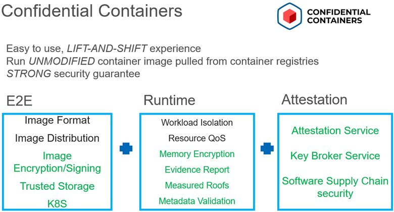

# Intel® TDX Confidential Containers

## Introduction
The Intel® TDX Confidential Containers is for protecting confidentiality and integrity of sensitive workload and data running in cloud native way using container and Kubernetes by leveraging Intel® Trust Domain Extensions (TDX) technology.
CoCo Overview
Confidential Containers (CoCo) is a new sandbox project of the Cloud Native Computing Foundation (CNCF) of enabling cloud-native confidential computing by taking advantage of a variety of hardware platforms and software technologies. Intel® TDX confidential container solution is based on CoCo and implements a lot of features especially in two aspects. The first is of easy to use. For application developers, they can run unmodified container images in TDX confidential container. For Kubernetes operators/admins, they can use standard Kubernetes tools to install the total solution and manager the Kubernetes clusters. The second is of assuring strong security by providing End2End protection to sensitive and high value applications, data, and models.
Design Principle
-	Easy to use without change of application
-	Easy to deploy and ops 
-	Easy to integrate without knowledge of HWTEE
-	Remove k8s cluster admin from TCB in addition to infrastructure provider like CSP
-	End2End strong security including runtime/storage/secrets with remote attestation
 
 
 
## CoCo Architecture
The following diagram provides an overview of TDX confidential container architecture with key components. 
Only the components in green box are in TCB. As launching a Kubernetes pod with TDX CoCo runtime, the firmware, guest kernel, kernel cmdline are measured;
Guest rootfs including kata-agent are also protected and verified by feature of measured rootfs. 
The encrypted container image is pulled and decrypted within TDX guest and storage allocated by CSI driver is decrypted before use as well.
All credential info like image decryption key, image signing signature file, launch policy are retrieved if and only if remote attestation is successful.
 
 
