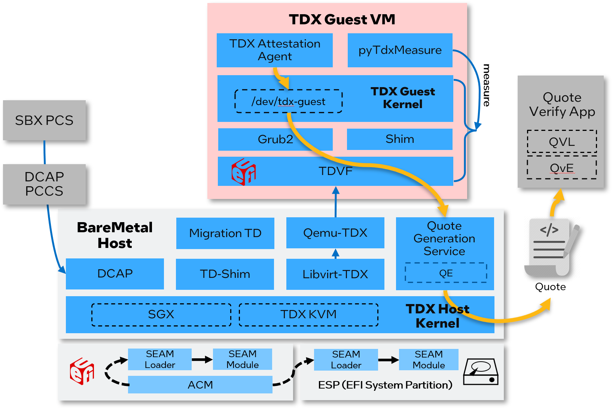

# Linux Stack for Intel TDX Overview

Intel provides [tdx-tools](https://github.com/intel/tdx-tools) to keep evolving along with kernel version. It supports kernel 5.15, kernel 5.19 and kernel 6.2. The Linux Stack for Intel TDX helps to:

- Build individual component's package or install pre-build binaries on IaaS host or create PaaS guest image for quick evaluation
- Generate the patch set for deep dive in source code level
- Test, hack and debug the TDX technology based on PyCloudStack framework
- Dump guest VM measurement and generate TD quote report for TDX E2E attestation
- Measured boot and Secure boot for TDX guest VM

Linux Stack for Intel&reg; TDX includes the components in
below diagram:

| Name | Stack | Description |
| -- | -- | -- |
| TDX Kernel | Host + Guest | Linux kernel for TDX |
| TDX Qemu-KVM | Host | Qemu VMM for TDX |
| TDX SEAM Module | Host | TDX Secure Arbitration Module |
| TDX Migration | Host | Migration TD for live migration |
| [TDX Libvirt](https://github.com/intel/libvirt-tdx) | Host | The modified libvirt to create TDX guest domain via Qemu |
| [TDVF](https://github.com/tianocore/edk2) | Host | The modified OVMF(Open Source Virtual Firmware) to support TDX guest boot like page accept, TDX measurement |
| [TDX Grub2](https://github.com/intel/grub-tdx) | Guest | The modified grub for guest VM to support TDX measurement |
| [TDX shim](https://github.com/intel/shim-tdx) | Guest | The modified shim for guest VM to support TDX measurement |

Please refer to [Quick Start](https://github.com/intel/tdx-tools/blob/main/README.md#3-getting-started) to build TDX Linux Stack, including Host kernel, Guest kernel and other components.

You can deploy the built TDX linux stack components in a platform with TDX enabled CPU and IFWI.
