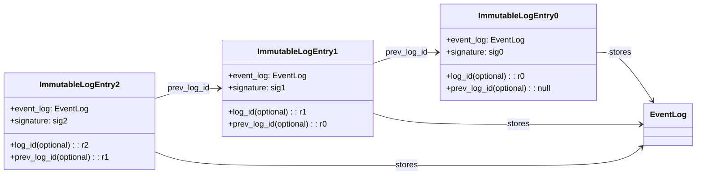

# Trusted Log Module

## Overview

The Trusted Log module provides a tamper-evident record of build, publish, and deployment activities for container images.
It records events in an immutable log system (transparent log and/or on-chain log) using a chained model, and extends event digests into local runtime measurements (for example RTMR) to bind event history to local TCB state.
This allows users and applications to verify both:

- Remote immutable event history.
- TEE quote evidence for expected runtime state.

## Why This Exists

- Create a verifiable audit trail for trusted supply-chain operations.
- Preserve ordering and linkage between recorded events, and correlate those events with local TCB (Trusted Computing Base) measurements.
- Support later verification of chain integrity, signatures, and replayed event-log content.
- Allow export and restore of chain state across process boundaries (reserved for future scope).

## Core Concepts

### Chained Record

The Trusted Log module persists event records into immutable backends (transparent log and/or on-chain log) using a chained record model.
If a verifier has the latest log ID, it can traverse previous IDs to replay and validate the chain.
Each persisted immutable-log entry wraps one committed `EventLog` and chain linkage metadata.

### Commit Queue and Async Submission

Because remote immutable log submission and local RTMR extension are not always synchronized, the module keeps a local commit queue (durable over process reboots, e.g. disk-backed file, SQLite database, or existing `backup_file_path` mechanism inherited from the legacy `tlog_chain.py` model).
`commit_record()` finalizes an event, computes its digest, signs it, and durably enqueues it.
`submit_record(record_id)` later publishes the previously committed queued event to the immutable backend and applies queue-state transitions internally.
Event digests can be extended to local measurement registers at commit time, while remote log submission can complete later via a Submission Daemon.
When queued events are confirmed by the remote immutable system, they are removed from the local commit queue.

`get_commit_queue_status()` is the worker-facing API used to decide whether queued work exists and which `record_id` should be attempted next.
`get_latest_state()` is a compact summary API that should return:

- The latest confirmed immutable log ID.
- The number of records still pending remote confirmation.
- Pending event identifiers when available.

Detailed retry metadata belongs in queue-specific monitoring views rather than in `LatestState`.

This model keeps queue draining and observability separate while preserving a single mutation path for remote publication.

### Identity and Signing

Signing uses an identity token and Sigstore production signing context (or a locally generated asymmetric keypair).
If the identity token or pending data is missing, signing fails fast.

**Crucially, the identity token's lifecycle is restricted entirely to the caller's synchronous request.** 
During `commit_record()`, the short-lived OIDC token is immediately consumed to generate the signature and certificate bundle. The sealed `EventLog` written to the `Commit Queue` contains the finalized signature but **no identity tokens**. The background Submission Daemon executing `submit_record()` later merely forwards this static, fully-signed payload to the remote backend. The daemon requires no identity context, elegantly avoiding OIDC token expiration timeouts during offline queuing or retry loops.

## High-Level Lifecycle

1. Initialize a trusted event-log instance, with or without a previous event-log ID.
2. Add operation metadata into the new event-log entry list (one or more records).
3. Call `commit_record()` to finalize the event, compute the digest, and enqueue the committed record for publication.
4. Extend the event digest into local measurement registers as part of the commit path when a local MR backend is enabled.
5. Use `get_commit_queue_status()` plus `submit_record(record_id)` to publish committed queued records to remote immutable storage.
6. If remote submission is delayed or blocked (for example network latency or ordering dependencies), the committed record remains in the local commit queue with retry metadata.
7. A background retry worker resubmits delayed queued records until confirmation.

## Public API Summary

The Python API exposed by `TrustedLogAPI` centers on a small set of operations:

- `init_record()`: create a new mutable record context.
- `add_entry()`: append ordered entries into the current record.
- `commit_record()`: finalize the current record and place it into the commit queue.
- `get_commit_queue_status()`: report whether queued committed work exists and which record should be submitted next.
- `submit_record()`: publish one previously committed queued record and apply queue-state updates internally.
- `get_latest_state()`: return compact confirmed-state and pending-event summary information.
- `get_event_log()`: load one committed immutable event by backend log identifier.
- `verify_record()`: replay and verify a committed record or chain.

Implementations of `TrustedLogAPI` must support multi-threaded or multi-worker execution, because commit and submit operations may run in different worker contexts against shared queue state.

## Verification Capabilities

At a high level, verification includes:

- Structural integrity checks for sequence order and hash linkage.
- Signature verification for each committed entry against policy.
- Replay-based recomputation of stored event digests from canonical persisted event-log content.
- Optional correlation of replayed event digests with local-measurement claims such as RTMR values.
- Aggregated success/error reporting across the chain.

Verification should treat the persisted immutable `EventLog` payload as the source of truth.
The verifier should resolve the target log, replay ordered entry digests from canonical data, recompute the event digest, validate chain linkage and signatures, and then compare the replayed digest against the stored immutable-log value.

## Integration with `tc_api` Workflows

The Trusted Log module is designed to integrate seamlessly into the external `tc_api` (Trust Container API) orchestrator, providing audit trails for lifecycle events like building or pushing Docker images.

Because operations like `docker push` can be time-consuming and network-dependent, Trusted Log embraces an asynchronous Submission Daemon pattern.

### Example: Tracking a Docker Push

1. **Initialization**: When the `tc_api` endpoint is hit (e.g., `/push`), within the workflow in `services.py`, `TrustedLogAPI.init_record()` is called to create a record context.
2. **Recording Fact**: As the `docker push` subprocess executes and returns metadata (like image digest, registry URL), `add_entry` is used to append this data into the log schema.
3. **Commit (Synchronous)**: Before the API replies to the user, the workflow correctly calls `commit_record()`. This action rapidly calculates the chain hashes, extends the value into the local TDX RTMR, issues a local cryptographic signature, and drops the record into a durable `Commit Queue`. 
4. **Daemon Processing (Asynchronous)**: A dedicated daemon thread/process (the Submission Daemon) continuously monitors the `Commit Queue`. It independently polls via `get_commit_queue_status()`, then calls `submit_record()`, completing the high-latency I/O task to push the verifiable logs to the external remote backend (transparent log or blockchain) while automatically applying exponential backoff retries if the backend drops.

## Testing and Regression Verification

To guarantee cryptographic and chain-link consistency after refactoring (e.g. from the legacy `tlog_chain.py`) and future modifications, the Trusted Log relies on the following testing layers:

### 1. Unit Tests (Adapter and Hash Logic)
- **Digest Determinism**: Provide fixed mock inputs to `Entry` and `EventLog` structures and assert that the generated SHA-384 hashes remain exactly identical to prevent format serialization drifts.
- **Core API State Transitions**: Mock the `LocalMRAdapter` and `ImmutableLogAdapter`. Validate that triggering `init_record` -> `add_entry` -> `commit_record` securely transitions elements from in-memory objects to the localized queue buffer without premature backend calls.
- **Legacy Adapter Compatibility**: Test the `ChainedTransparencyLog` adapter conversion to ensure it can successfully load old `.sigstore.json` backup files, parse signature keys/indexes, and reconstruct logically valid `EventLog` object graphs equivalent to the new schema.

### 2. Concurrency & Daemon Integration Tests
- **Multi-threaded Enqueue**: Spawn threads that concurrently fire `init` and `commit_record` against the identical `TrustedLogAPI` instance. Confirm that internal locking coordinates proper strictly-monotonic `sequence_number` assignment and `previous_hash` chains without race conditions.
- **Daemon Retry Simulator**: Mimic a backend network drop by throwing `BackendSubmitError` from the `ImmutableLogAdapter`. Assert the daemon gracefully retains the item with `queue_status = PENDING` and attempts a safe retry.

### 3. E2E Cryptographic Verification
- **Full Chain Replay (`verify_record`)**: Generate a mock chain of 10 sequential events (including *Event Log 0* containing the injected Mock Public Key). Persist them, then successfully trigger the `verify_record` replay verification.
- **Tamper Detection Simulation**: Deliberately modify a single payload byte of `value` inside index sequence 5. Confirm that the Verifier explicitly fails sequence 5's direct signature match, and subsequently flags broken `previous_hash` link ruptures for all trailing elements 6 through 10.

## Boundaries and Non-Goals

Current scope of this module documentation:

- High-level architecture and behavior.
- Data flow, lifecycle semantics, and replay-based verification requirements.

Out of scope for this page:

- Deep operational runbooks.
- Provider-specific policy tuning examples.
- Troubleshooting matrix for every failure mode.

## Related Documents

- See [architecture.md](/home/ed_song/tc_api_refactor/tc_api/trusted-log/architecture.md) for the component-level view, concurrency model, and replay verification requirements.
- See [api.md](/home/ed_song/tc_api_refactor/tc_api/trusted-log/api.md) for Python API signatures, type contracts, and caller lifecycle examples.
