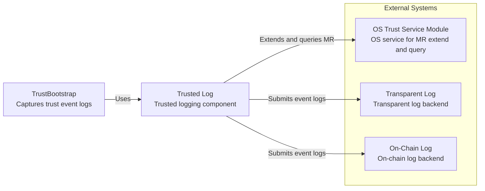
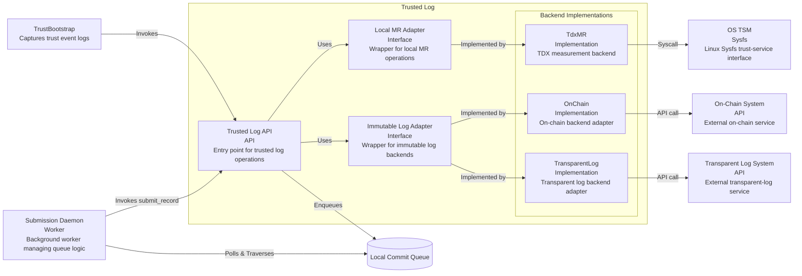
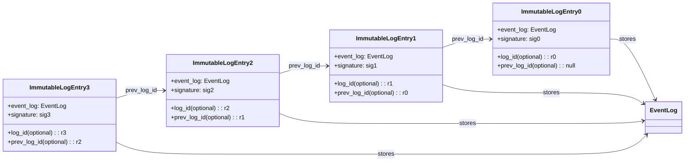
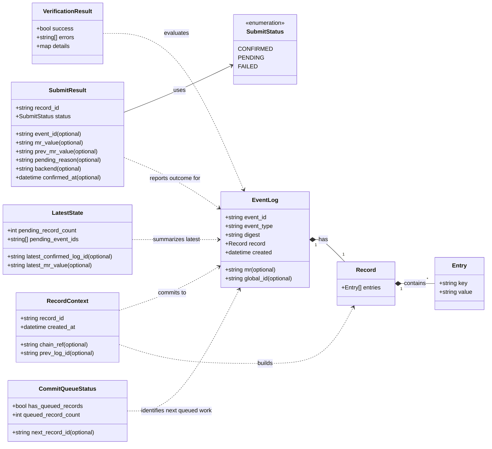
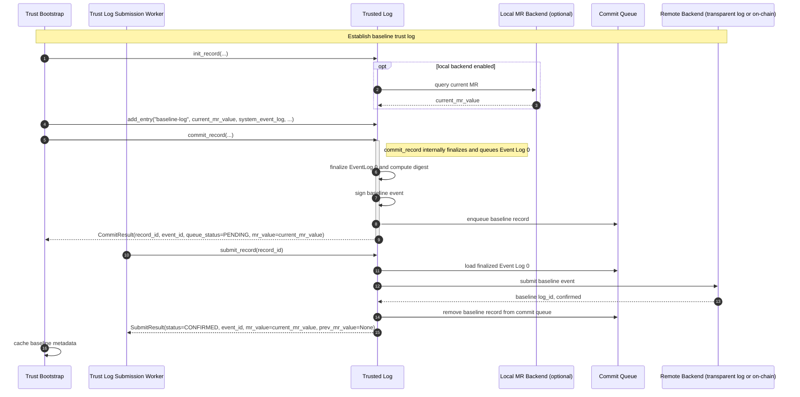
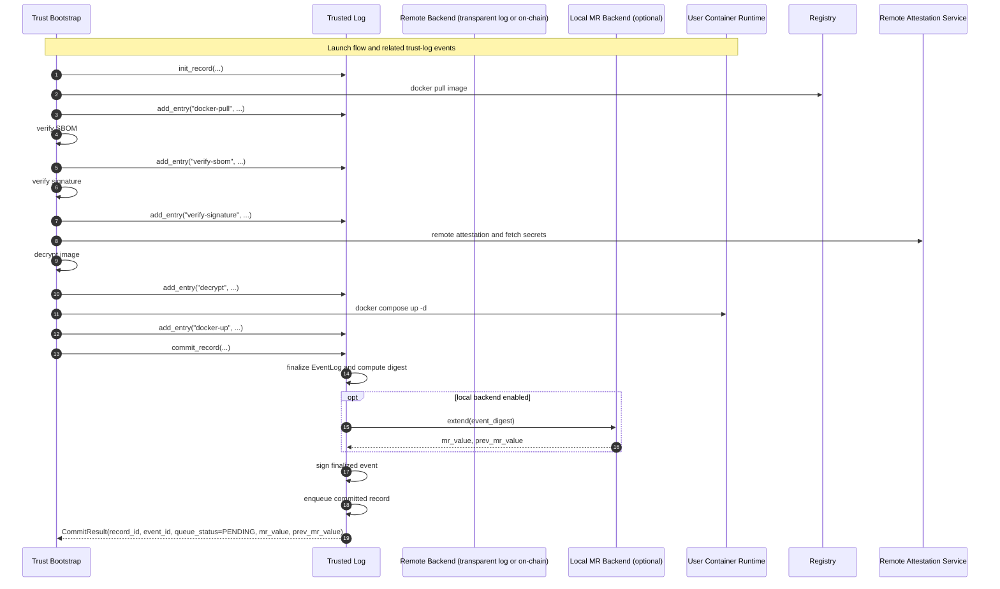
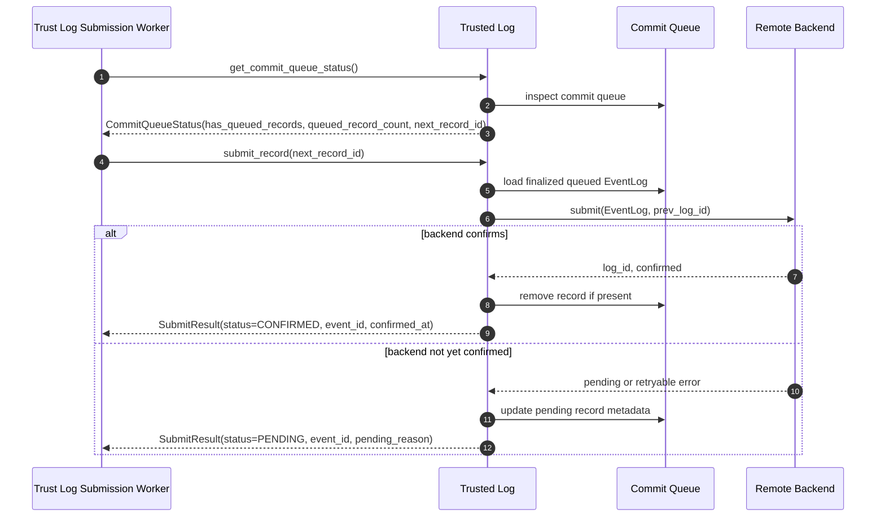

# Trusted Log Architecture

## Purpose

Trusted Log is the auditability layer for container lifecycle workflows in this project.
It records operation metadata as a hash-linked sequence of signed entries in immutable log backends (transparent log and/or on-chain log).
In parallel, event digests are extended into local runtime measurement registers (for example RTMR) so attestation can correlate remote event history with local TCB state.


## Architecture at a Glance

The module combines three planes:

- Immutable event persistence plane for remote tamper-evident history.
- Local measurement plane for runtime state binding.
- Verification plane for chain and signature validation.

In system context, Trusted Log provides trust-bootstrap logging functions by combining:

- Local trust service capabilities to extend event digests into local MR.
- Remote immutable persistence to store chained event logs.

Two immutable backends are currently in scope: transparent log and on-chain log.

The system-context diagram defines Trusted Log as the orchestrator between TrustBootstrap and external trust services.




### Core Component


The component diagram decomposes this orchestrator into a stable API layer, adapter interfaces, and backend-specific implementations.
This decomposition keeps trust-log semantics stable while allowing backend providers to change independently.

Component Diagram:


##### Responsibility Mapping

- Trusted Log API:
Receives event-log operations from TrustBootstrap, enforces workflow order, coordinates submit and query flows, and must preserve thread-safe behavior when commit and submit operations execute in different worker contexts.

- Submission Daemon:
A background worker or separate thread process that monitors the local Commit Queue, safely polls for finalized logs (`get_commit_queue_status()`), calls `submit_record()` autonomously, and applies exponential backoff for retries to avoid blocking API responses.

- Local MR Adapter:
Defines the local measurement contract (extend/query), independent of platform-specific backend details.

- Immutable Log Adapter:
Defines immutable-persistence operations (submit, resolve log id, chain traversal) independent of backend type.

- TdxMR implementation:
Implements Local MR Adapter using OS trust-service interfaces (for example Sysfs-backed TSM access).

- OnChain and TransparentLog implementations:
Implement Immutable Log Adapter for different immutable backends while preserving the same event and chain semantics.

##### Interaction Model

1. TrustBootstrap invokes Trusted Log API to create a record context and append one or more event entries.
2. TrustBootstrap signal Trusted Log to persistent the event log into immutable log system and meanwhile, the event digest shall be extended to the local MR as well. 
3. Trusted Log API computes or verifies event digests and sends extend/query actions through Local MR Adapter.
4. Trusted Log API sends immutable persistence actions through Immutable Log Adapter.
5. Backend implementations translate adapter operations into concrete syscalls or external API calls.
6. Trusted Log API returns combined result state, including immutable log identifiers and local MR-related outputs.

This layering allows backend evolution (for example adding new on-chain or transparent-log providers) without changing caller behavior.

### External Systems

Trusted Log coordinates with:

- Immutable log system: transparent log and/or on-chain log persistence targets.
- TEE measurement path: local RTMR extension path used for quote correlation.

### Data Structures

Trusted Log uses a small set of stable data contracts that map directly to the record lifecycle.
These contracts should remain consistent across API, storage, verification, and backend-adapter boundaries.

The structures fall into four groups:

- Record construction: `RecordContext`, `Record`, and `Entry` describe a record while it is still being assembled.
- Committed event payload: `EventLog` is the canonical immutable payload submitted to remote backends.
- Submission and state reporting: `SubmitResult`, `CommitQueueStatus`, and `LatestState` report commit outcomes and current chain state.
- Verification output: `VerificationResult` reports whether a target record or chain satisfies integrity and policy checks.

For API simplicity, `LatestState` should remain a summary view rather than a full queue-inspection contract.
Returning pending event identifiers is acceptable, but detailed retry and queue-management metadata should stay outside this summary API.
The common operational path is queue-driven: once a committed record enters the commit queue, a submission worker should attempt `submit_record(record_id)` without requiring the caller to orchestrate publication through repeated rich state polling.

Core contract definitions:

- `Entry`: the smallest unit of recorded evidence, represented as a `key` and `value` pair for one trust-relevant fact.
- `Record`: an ordered collection of entries accumulated before submission; ordering is significant because it affects the event digest.
- `RecordContext`: the mutable handle returned by initialization, containing the in-progress `record_id`, creation timestamp, and chain reference information such as `prev_log_id`.
- `EventLog`: the immutable committed event containing event identity, canonical digest, ordered record payload, creation time, and optionally the MR value and globally resolvable backend identifier.
- `SubmitResult`: the caller-facing result of `submit_record`, including commit status, backend outcome, and MR values associated with the submission.
- `CommitQueueStatus`: a lightweight worker-facing view that reports whether the commit queue contains committed work, how many records are queued, and which `record_id` should be attempted next.
- `LatestState`: a compact snapshot view of the most recently confirmed immutable-log entry, pending-record count, pending event identifiers, and the latest observed MR value.
- `VerificationResult`: the aggregate verification outcome for a record or chain, including a success flag, collected errors, and structured details for policy or backend-specific diagnostics.

#### On-Chain and Transparent-Log Chain Structure

- Transparent log: stores `log_id` and `prev_log_id` to preserve chain traversal.
- On-chain log: natively supports chained structure.
- In both cases, each backend entry wraps one `EventLog` plus backend linkage metadata.



#### Core Contract Structure



Message flow through these structures is intentional:

1. `init_record` creates a `RecordContext`.
2. `add_entry` appends ordered `Entry` values into the `Record` associated with that context.
3. `commit_record` seals the record into an `EventLog`, computes its digest, and moves it into committed queued state.
4. `submit_record` publishes a previously committed queued event, applies queue-state transitions internally, and returns a `SubmitResult`.
5. Later queries can expose `LatestState`, `EventLog`, or `VerificationResult` for that committed event chain.

If operators or a worker need per-record retry metadata, that detail should be exposed through a queue-specific monitoring or inspection view rather than enlarging `LatestState` itself.

#### Digest Algorithm

Digest construction should be deterministic, order-preserving, and tied to the event identity that is stored remotely.
For that reason, Trusted Log should hash a canonical serialized form of each structure rather than a loosely concatenated field list.

Let $Canonical(x)$ denote a stable UTF-8 serialization of $x$ with fixed field ordering.

$$Entry\_Digest_i = SHA384(Canonical(\{key_i, value_i\}))$$

$$Event\_Digest = SHA384(Canonical(\{event\_id, event\_type, created, [Entry\_Digest_1, \ldots, Entry\_Digest_n]\}))$$

$$MR_{t+1} = Extend(MR_t, Event\_Digest)$$

Design notes:

- Entry order is significant; reordering entries produces a different event digest.
- The `event_id` and `created` fields bind the digest to one concrete event instance rather than only to its payload.
- The `digest` field stored in `EventLog` should be the canonical SHA-384 result, typically rendered as `sha384:<hex>`.
- The same `Event_Digest` is used for both immutable-log submission and local MR extension so remote verification and attestation evidence refer to the same event state.


#### Event Log 0
Event Log 0 is the baseline record created when Trusted Log is initialized by Trust Bootstrap.
It captures the environment in which Trust Bootstrap starts, using the latest RTMR value together with system event evidence already available from the platform.

Event Log 0 is persisted to the immutable log backend, but its creation does not perform a new RTMR extend.
The purpose of this record is to anchor the trusted-log chain to the pre-existing platform state rather than to mutate that state again during initialization.

Its contents should include the current RTMR snapshot and the CCEL-formatted system event log queried through the platform API, covering the measured boot path from TDVF through guest OS loading.
Trust Bootstrap itself is assumed to be part of the measured base image, so Event Log 0 serves as the immutable-chain starting point for all later Trust Bootstrap event logs.

Every subsequent event log created by Trust Bootstrap should reference Event Log 0, directly or indirectly, as the base entry of the chain.


#### JSON Mock-Up

```json
{
  "event_id": "evt-000001",
  "event_type": "launch-container",
  "digest": "sha384:4f3a9e8d6c2b1a0f9d8c7b6a5e4d3c2b1a0f9d8c7b6a5e4d3c2b1a0f9d8c7b6a",
  "record": {
    "entries": [
      {
        "name": "docker-pull",
        "image_hash": "sha384:1111111111111111111111111111111111111111111111111111111111111111",
        "image_size": 18374656,
        "cmd": "docker pull ghcr.io/example/app:1.2.3",
        "created": "2026-03-20T10:15:30Z",
        "digest": "sha384:aaaa..."
      },
      {
        "name": "verify-sbom",
        "sbom_hash": "sha384:2222222222222222222222222222222222222222222222222222222222222222",
        "sbom_format": "spdx-json",
        "cmd": "cosign verify-attestation --type spdxjson ghcr.io/example/app:1.2.3",
        "created": "2026-03-20T10:15:45Z",
        "digest": "sha384:bbbb..."
      },
      {
        "name": "verify-signature",
        "signature_subject": "ghcr.io/example/app:1.2.3",
        "signature_digest": "sha384:3333333333333333333333333333333333333333333333333333333333333333",
        "cmd": "cosign verify ghcr.io/example/app:1.2.3",
        "created": "2026-03-20T10:16:00Z",
        "digest": "sha384:cccc..."
      },
      {
        "name": "decrypt",
        "artifact": "runtime-secrets.env.enc",
        "key_ref": "kek://kms/prod/tc-api",
        "cmd": "openssl enc -d -aes-256-gcm -in runtime-secrets.env.enc -out runtime-secrets.env",
        "created": "2026-03-20T10:16:15Z",
        "digest": "sha384:dddd..."
      },
      {
        "name": "docker-up",
        "compose_file": "docker-compose.yml",
        "service_count": 5,
        "cmd": "docker compose up -d",
        "created": "2026-03-20T10:16:30Z",
        "digest": "sha384:eeee..."
      }
    ]
  },
  "mr": "sha384:4f3a9e8d6c2b1a0f9d8c7b6a5e4d3c2b1a0f9d8c7b6a5e4d3c2b1a0f9d8c7b6a",
  "created": "2026-03-20T10:16:35Z",
  "uuid": "log-uuid-example"
}
```

## State Model

### Mutable Runtime State

- pending_entries: in-memory metadata not yet committed.
- current_sequence: next sequence number.
- last_signature_hash: pointer used as previous_hash for next commit.
- chain_history: ordered list of committed entries.
- chain_id: stable identifier for the chain instance.
- latest_confirmed_log_id: most recent immutable-log-confirmed record identifier.

### Persisted State

Exported chain data includes:

- chain_id
- chain_history entries
- current_state block with sequence, hash pointer, and pending entries

This enables checkpoint and restore behavior using backup files.

### Concurrency Requirement

`TrustedLogAPI` implementations must support multi-threaded and multi-worker use.
In particular, `commit_record` and `submit_record` may run in different worker contexts against the same chain and queue state.

The implementation should therefore guarantee:

- thread-safe access to in-memory record assembly state, commit-queue state, and latest confirmed chain pointers
- atomic transition of one record from in-progress state to committed queued state during `commit_record`
- atomic transition of one queued record through submission result handling during `submit_record`
- visibility guarantees such that a worker calling `submit_record(record_id)` never observes a partially finalized record
- duplicate-submission protection so concurrent workers do not confirm or mutate the same queued record inconsistently

This does not require a specific locking model, but the implementation must provide equivalent safety through process-local locks, transactional persistence, compare-and-swap style state transitions, or another concurrency-safe mechanism.

### Disaster Recovery and Partial Failures

Two heterogenous environments are modified during `commit_record()`: the local MR (e.g., RTMR via Sysfs) and the persistent Commit Queue (e.g., an SQLite database). If an instance crashes in between extending the MR and persisting to the Queue, a *partial failure* occurs where the MR is permanently decoupled from the event block.
To prevent this desynchronization, implementations should place the intended `EventLog` locally before firing the RTMR extend operation. Because general disk storage on cloud hosts is mutually untrusted, placing the SQLite WAL log in ephemeral `tmpfs` (e.g., `/dev/shm/commit_queue.db`) prevents plaintext leakage at rest while fully relying on Confidential VM memory encryption. In this environment, a VM reboot destroys the unsent queue; this ephemeral security trade-off is accepted by design.

## End-to-End Flow

### Trust Log Initialization
Trusted Log must be initialized with the runtime context required to build a verifiable event chain.
That context is owned by the caller, such as Trust Bootstrap, and must be preserved for the full lifecycle of the workload session.

At minimum, initialization should establish:

- the chain identity and the reference to the latest committed immutable-log entry, if one already exists
- the baseline local measurement state, such as the current RTMR value when available
- the record metadata required to create Event Log 0 and all subsequent event logs
- the backend configuration and credentials needed for immutable-log submission and later verification

This initialization step defines the trust context for every later `add_entry`, `commit_record`, `submit_record`, query, and verification operation.

### Identity and Public Key Management

Trusted Log currently supports keyless signing (via Sigstore OIDC) but may also use traditional asymmetric keypairs (e.g., RSA, ECDSA) generated securely within the TEE.
To optimize verification overhead, the public key does **not** need to be attached to every log entry. Instead:
- The public key is embedded exclusively within the `pub_key` field of **Event Log 0** (the root of the chain).
- Because subsequent logs are strictly linked via cryptographic hashes (`prev_log_id` / `previous_hash`), any verifier can securely traverse from the root, extract the verified public key from Event Log 0, and use it to validate the signatures of all subsequent entries in that chain instance.

### Identity Token Lifecycle and Separation of Duties

When using OIDC tokens (like in Sigstore keyless signing), the tokens are ephemeral and often expire within minutes. This presents a challenge for asynchronous submission. To resolve this:
- **Synchronous Signing (`commit_record`)**: The API caller securely holds the short-lived Identity Token within their request lifecycle. `commit_record()` immediately consumes this token to interact with the CA (e.g., Fulcio) to sign the payload and generate a complete, self-contained signature bundle.
- **Stateless/Tokenless Submission (`submit_record`)**: The sealed `EventLog` written to the durable `Commit Queue` contains the finalized signature and certificates, but **no identity tokens**. The background Submission Daemon simply forwards this static payload to the remote backend (Transparent Log/Blockchain). It never requires or possesses the OIDC token, rendering it completely immune to token expiration issues during network retries or delayed submissions.

#### Pseudo-code Implementation Example

```python
# 1. API Call (Synchronous Context with active OIDC Token)
def api_handle_push_event(event_data: dict, oidc_token: str):
    # Consume short-lived token immediately to get an ephemeral certificate via CA
    certificate, ephemeral_private_key = CA_Client.exchange_token(oidc_token)
    
    # Cryptographically sign the payload over the generated memory-resident private key
    signature = crypto_sign(event_data_digest, ephemeral_private_key)
    
    # Assemble the completely sealed Bundle
    event_log = EventLog(
        data=event_data, 
        signature=signature, 
        cert=certificate  # Public cert is attached, OIDC token + Private key discarded
    )
    
    # Durably save the static payload to the local queue
    local_commit_queue.enqueue(event_log)
    return {"status": "accepted_for_processing"}

# 2. Daemon Worker (Asynchronous Context without any OIDC Token)
def daemon_submission_worker():
    while True:
        # Load the sealed EventLog from the queue
        event_log = local_commit_queue.dequeue()
        
        # Heavy remote I/O: Submit the bundle to the Remote Backend (e.g. through the ImmutableLogAdapter).
        # The backend verifies if the signature was valid *during* the certificate's window,
        # completely agnostic to how long it sat in our Commit Queue.
        try:
            immutable_log_adapter.submit(event_log)
            local_commit_queue.mark_confirmed(event_log.id)
        except NetworkError:
            # Exponential backoff since we don't have to worry about token expiration
            time.sleep(backoff)
```

### Trust Log Initialization Flow

- On initialization, Trusted Log creates Event Log 0 from the latest local MR snapshot and baseline system-event metadata.
- Event Log 0 is first committed locally, so the baseline event is finalized, signed, and stored in the commit queue before any remote publication attempt.
- Unlike normal runtime events, Event Log 0 captures the current measured state but does not perform an additional MR extend; initialization queries the current MR and records that value as baseline evidence.
- After the baseline record is committed, a submission step publishes that already-finalized Event Log 0 to the immutable backend.
- Initialization is not considered complete until the baseline record is confirmed remotely, because that confirmed event becomes the immutable anchor for all later records.
- The confirmed baseline event identifier becomes the chain entry point for subsequent records.
- Open design question: how to handle runtimes that allow quote/report reads but not MR extend operations.



### Trust Event Log Submission Flow

Using trusted container launch as an example:



### Trust Event Log Publication and Commit Queue Check
`commit_record` finalizes the current in-memory record and moves it into a locally durable committed queued state.
This step is responsible for sealing the event before any remote publication attempt is made.

The `commit_record` path should behave as follows:

- Trusted Log seals the in-memory `Record` into an immutable `EventLog` and computes the canonical event digest.
- Trusted Log signs the finalized event and binds it to the chain by preserving the original `prev_log_id` linkage.
- If a local MR backend is available, Trusted Log extends the same event digest into the local MR and records the returned `mr_value` and `prev_mr_value`.
- Trusted Log writes the finalized event and its metadata into the local commit queue.
- Trusted Log returns a commit result that confirms the event is finalized and queued for later publication.

`submit_record` is a separate publication API.
It takes a previously committed queued record and attempts submission to the configured immutable backend without rebuilding or mutating the event payload.
By default, this API is also responsible for applying the resulting commit-queue state transition internally, such as clearing a confirmed queued record or updating retry metadata for a still-pending record.

`get_commit_queue_status` is a small worker-facing query API.
It should answer only the question of whether the commit queue contains committed work and, if so, which `record_id` is next in submission order.

The publication path should behave as follows:

- A submission worker checks queue state through `get_commit_queue_status()`.
- If `has_queued_records=true`, the worker reads `next_record_id` and calls `submit_record(next_record_id)`.
- Trusted Log loads the finalized `EventLog` from the commit queue and attempts remote immutable-log submission.
- Trusted Log returns a `SubmitResult` whose `status` is `CONFIRMED`, `PENDING`, or `FAILED`.

To keep the API surface smaller, the preferred model is not to make callers manually walk a rich state object.
Instead, the commit queue itself should drive publication:

- when `commit_record` enqueues a finalized event, it should wake or notify the submission worker
- if the worker sees one or more queued records through `get_commit_queue_status()`, it should immediately call `submit_record(record_id)` for the next eligible item
- `get_latest_state()` remains optional observability API for health checks, attester reads, and dashboards

In other words, the default control flow is: queue has content -> worker submits queued records.
This makes `submit_record(record_id)` the only mutation API for queue-driven publication, keeps `get_commit_queue_status()` as the worker-facing lightweight queue check, and keeps `get_latest_state()` read-only and compact.

The meaning of each result state is:

- `CONFIRMED`: the immutable backend accepted the event and returned a stable backend identifier; Trusted Log advances `latest_confirmed_log_id` and removes the record from the local commit queue.
- `PENDING`: the event has been finalized locally, but immutable publication is not yet confirmed; the event remains in the local commit queue together with retry metadata and a `pending_reason`.
- `FAILED`: Trusted Log could not finalize or persist the event in a recoverable way; the caller receives an error outcome and the implementation should indicate whether the record is safe to retry.

These queue mutations should happen inside `submit_record()` itself rather than in the submission worker.
The worker should treat `SubmitResult` as the authoritative outcome and decide only whether to continue, back off, or escalate.

Commit queue entries should retain enough metadata for safe resubmission and operator visibility, including:

- `record_id` and `event_id`
- computed digest and `prev_log_id`
- backend target and last submission attempt time
- retry count and last error or pending reason
- local MR status, including whether extend succeeded, failed, or was deferred

Commit queue status should be exposed through a compact `get_latest_state()` summary and, when needed, an implementation-specific monitoring or queue-inspection view.
At minimum, `get_latest_state()` should allow a caller to determine:

- the latest confirmed immutable-log identifier
- whether queued work still awaiting confirmation exists, for example through `pending_record_count`
- which event IDs are currently pending publication
- the latest observed MR value

For worker control flow, `get_commit_queue_status()` should allow a caller to determine:

- whether any committed queued record exists
- how many committed records are currently queued
- which `next_record_id` should be attempted first

If a worker or operator needs more detail, the queue-specific monitoring view should expose:

- which `record_id` values are still pending
- whether a pending record is committed and ready for submission
- whether a pending record has already completed local MR extension
- the last known backend submission result for each pending record

Publication retry should follow these rules:

- retry must reuse the finalized `EventLog` payload rather than rebuilding it from mutable caller state
- retry must preserve the original digest, `event_id`, and chain linkage
- once the backend confirms publication, the record is removed from the commit queue and `latest_confirmed_log_id` is updated
- repeated transient backend failures keep the record in queued pending state until retry policy is exhausted or an operator intervenes

The submission worker remains responsible for draining queued pending state, deciding when to retry, and surfacing persistent failures to higher-level orchestration.
This worker may be implemented by Trust Bootstrap itself or by a separate asynchronous retry component, but the public API should keep a clean split between summary state and publication actions.
Because `commit_record` and `submit_record` may execute in separate worker contexts, queue inspection and queue mutation must remain concurrency-safe under overlapping calls.

#### Submission Worker Walkthrough

The default walkthrough should be straightforward:

1. `commit_record` finalizes an `EventLog` and enqueues it into the commit queue.
2. Queue enqueue wakes the submission worker immediately, or the worker observes the queue on a short periodic interval.
3. The worker calls `get_commit_queue_status()`.
4. If `has_queued_records=false`, the worker returns or sleeps.
5. If committed records exist, the worker uses `next_record_id`.
6. The worker calls `submit_record(next_record_id)`.
7. On `CONFIRMED`, `submit_record()` has already removed the record from the commit queue, and the worker continues with the next queued item.
8. On `PENDING`, `submit_record()` has already preserved the record and updated retry metadata, and the worker backs off according to policy.
9. On `FAILED`, `submit_record()` has already persisted operator-visible failure details when appropriate, and the worker stops or escalates according to policy.

This walkthrough matches the operational expectation that any committed queued record should be submitted as soon as practical, without forcing the caller to repeatedly poll and dispatch each item manually.



## Attester Query Model

When an attester asks for latest trusted-log state, the module should expose:

- Latest confirmed immutable-log ID.
- Whether queued local entries still awaiting confirmation exist, including pending event identifiers when available.

This allows verifiers to reason about both confirmed history and in-flight updates.

## Hash-Linking Semantics

For each committed entry:

- current_hash is derived from the serialized payload of that commit.
- previous_hash references the prior committed current_hash.
- first entry uses an empty previous reference.

This creates a linear tamper-evident chain.

## Signing and Verification Responsibilities

### Signing

- Requires identity token.
- Requires non-empty pending data.
- Produces a Sigstore bundle and extracts log index metadata.
- Appends a new ChainEntry and advances sequence state.
- Triggers downstream immutable-log submission and local digest-extension flow.

### Verification

- Validates structural integrity first (sequence and hash linkage).
- Maps recorded entries to signature artifacts.
- Verifies each entry against configured verification policy.
- Correlates trusted-log evidence with attestation expectations at a high level.
- Returns aggregate status and detailed error collection.

Verification should explicitly support event log replay.
Replay means reconstructing the expected event state from the persisted immutable `EventLog` payload, recomputing its digests from canonical data, and checking that the stored record, chain linkage, signature evidence, and local-measurement claims remain internally consistent.

The replay requirement should include the following steps:

1. Resolve the target event log by immutable identifier, event identifier, or chain traversal starting point.
2. Load the persisted `EventLog` exactly as committed, including ordered `Record.entries`, `event_id`, `event_type`, `created`, `digest`, `mr`, and backend linkage metadata such as `prev_log_id`.
3. Recompute each `Entry_Digest_i` from the canonical serialized form of the stored entry values.
4. Recompute the expected `Event_Digest` from the canonical serialized form of `event_id`, `event_type`, `created`, and the ordered list of replayed entry digests.
5. Compare the replayed event digest against the `digest` stored inside the immutable `EventLog`.
6. Verify that the chain linkage is valid, including any `prev_log_id` reference and any backend-specific previous-entry relationship.
7. Verify signature artifacts and submission receipts against the replayed immutable payload rather than trusting stored digest fields alone.
8. If the event claims an `mr` value or participates in attestation correlation, verify that the replayed `Event_Digest` is the same digest that would have been extended into the local MR.
9. Return a `VerificationResult` that distinguishes structural failure, digest mismatch, signature failure, chain-link failure, measurement mismatch, and policy failure.

The replay computation should be deterministic and must not depend on mutable caller-side state.
Verification must use the persisted ordered entries as the source of truth, because entry ordering is part of the event identity.
Any difference in canonical field ordering, entry ordering, `event_id`, `event_type`, or `created` timestamp must produce a replay mismatch.

At minimum, the verification implementation should compute:

$$Entry\_Digest_i = SHA384(Canonical(\{key_i, value_i\}))$$

$$Replayed\_Event\_Digest = SHA384(Canonical(\{event\_id, event\_type, created, [Entry\_Digest_1, \ldots, Entry\_Digest_n]\}))$$

And then enforce:

$$Replayed\_Event\_Digest = Stored\_Event\_Digest$$

If measurement correlation is enabled, verification should additionally check that the replayed event digest is the digest logically extended into MR state for that event, even if the verifier only has an attested MR snapshot rather than a full local replay environment.

## Integration Touchpoints

### API Layer

The API flow creates and passes a chain instance through build, publish, and deployment operations, captures trusted-log status in responses, and supports direct retrieval of committed event logs by immutable log identifier for replay and verification.

### Service Layer

Service operations attach metadata and commit entries across key steps such as image build, SBOM generation, signing, encryption, push, pull, and attestation-related checks.

### Async Retry Worker

An asynchronous worker is responsible for re-submitting entries that could not be confirmed by immutable backends on the first attempt.
This decouples local progress from transient network or backend delays.

## Extension Points

Potential extension directions without changing core semantics:

- Alternative storage backends for exported chain snapshots.
- Backend adapters for mixed transparent-log and on-chain deployment models.
- Additional metadata schema validation before commit.
- Policy profiles for different verification strictness.
- Observability hooks for metrics and tracing around sign/verify latency.

## Invariants

The following invariants should remain true:

- sequence numbers are monotonic and contiguous.
- each non-genesis entry links to the exact previous hash.
- commit clears pending buffer after successful append.
- confirmed immutable-log state and local commit-queue state are both representable.
- import/export round-trip preserves verification behavior.

## Non-Goals of This Document

This architecture page intentionally excludes:

- detailed operator runbooks
- environment-specific Sigstore identity setup guides
- exhaustive troubleshooting procedures
